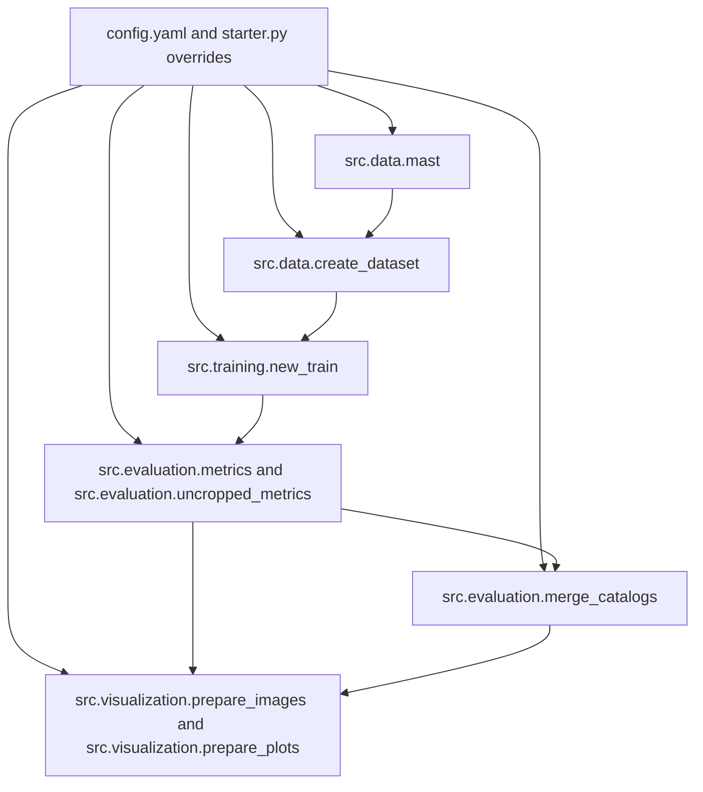
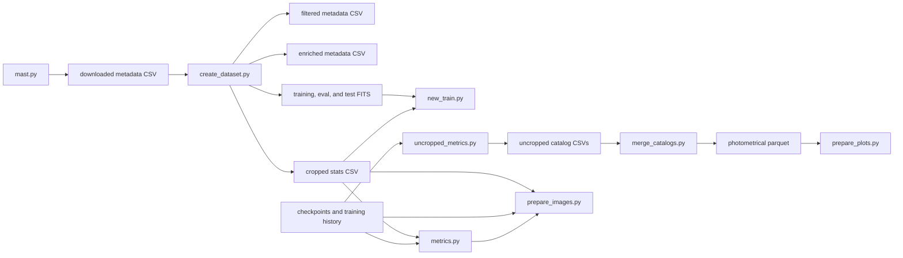
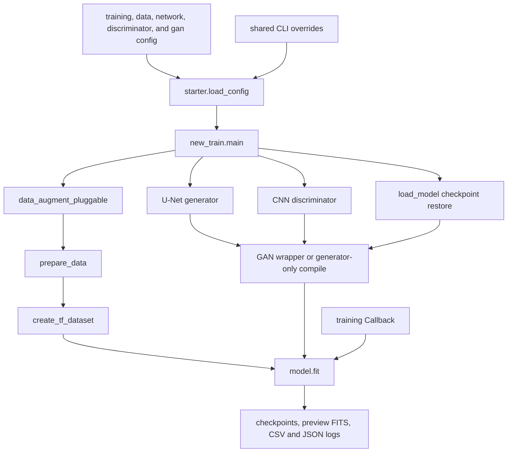
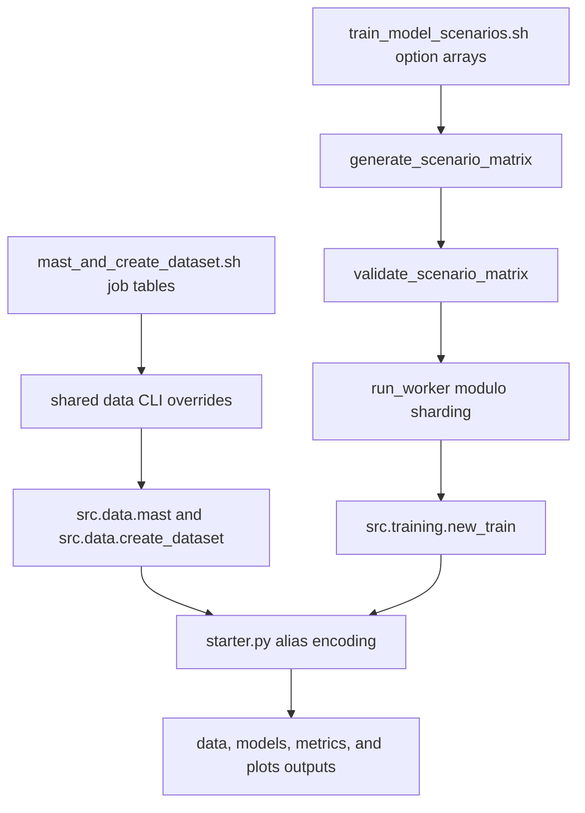
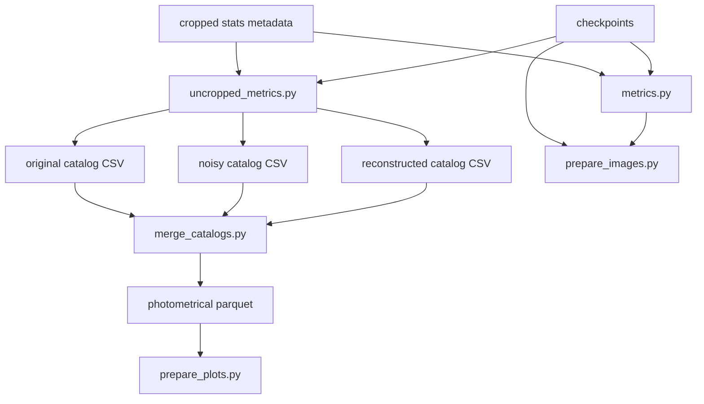

# AstroGAN-UNet
AstroGAN-UNet is my bachelor thesis project in physics, developed at the Max Planck Institute for Astronomy in Heidelberg under the supervision of Dr. Ivelina Momcheva.

The project addresses a practical astronomy problem: many surveys in MAST are shallow and noisy, while deep observations are limited and expensive. This repository builds a reproducible pipeline to train image-reconstruction models that map noisy/shallow inputs toward cleaner reconstructions, then evaluates whether recovered structure and photometry remain scientifically useful. 

Technically, AstroGAN-UNet is a TensorFlow/Keras pipeline for FITS-based denoising with U-Net and GAN variants, followed by source-extraction metrics, uncropped photometric catalog generation, and final visualization/report outputs.

The network module is where the model is built. The model used in this project is either U-Net or a GAN with U-Net as the generator and normal CNN as the discriminator. The use of gan can be turned off by the parameter 'use_gan' in the config which can be overridden in runtime as well (TODO: add how). Attention mechanisms (TODO: add what they are and how they are used) can be turned on and off by (TODO: add which tag and how). This behaviour can also be overridden in runtime (TODO: add how). All network parameters such as batch normalization, the batch size, the dropout rate, in which layer it should start, loss and activation functions for both the generator (U-Net) and the discriminator (CNN), the number of layers, dimensions, epochs, saving rates, training and evaluation data etc. can be customized in the config.yaml or be overriddden during runtime using parsing, which allows a very versatile architecture as well  testing, experimenting with different configurations etc.(TODO: add a .md file for different parsing options as well as network parameters and refer to it here). 

The data and models directories follow a deterministic directory hierarchy based on the chosen options in the config or runtime overrides. Codifying such information directly into directory and filenames would have resulted in very long strings which is why there are specific functions in starter.py to encode and decode these information. There is a script under src which maps such encoded names to required info (TODO: write a script which should return the decoded info from a string which could be a model or data directory or filename, keep it simple, use the already existing functions). Following this scheme allows training and evaluating multiple configurations in parallel without the need to manually change filenames, paths and configurations. 

This model is developed to work with deep galaxy surveys. More precisely with images taken with Wide Field Camera (WFC3) and filter F160W on Hubble Space Telescope (HST) which is (TODO: add context here). The units are 'electron/s'. However, since none of these parameters are harcoded, they can be changed so that the model(s) can be used on different images. If the units are not in 'electron/s', the calculations especially the simulated noise creation might not as intended so change either the units or modify the functions for noise creation. Furthermore, the repository allows the filtering of surveys by last name, survey info or exposure time (TODO: add tags here) either via config or through runtime overrides. 

'mast' queries the MASt database with given parameters and creates a .csv file (TODO how and which files). 


The active pipeline is implemented under `src/`. The `legacy/` directory contains older standalone scripts that are not part of the current `src/` execution path and should be treated as historical utilities.


## Table of Contents

1. [Overview](#overview)
2. [Environment and Setup](#environment-and-setup)
3. [Workflow Summary](#workflow-summary)
4. [Architecture Diagrams](#architecture-diagrams)
5. [Repository Structure](#repository-structure)
6. [Pipeline](#pipeline)
7. [Dataset Generation Internals](#dataset-generation-internals)
8. [Model Configuration](#model-configuration)
9. [Bash Scripts](#bash-scripts)
10. [CLI Reference](#cli-reference)
11. [Hyperparameter Sweeping](#hyperparameter-sweeping)
12. [Usage Examples](#usage-examples)
13. [Output Files](#output-files)
14. [Developer Notes](#developer-notes)
15. [Stage READMEs](#stage-readmes)

## Overview

The repository implements a six-stage workflow:

1. Query MAST metadata and optionally resolve or download FITS products.
2. Filter metadata, split data, crop FITS images, and compute dataset statistics.
3. Train either a U-Net generator alone or a GAN consisting of a U-Net generator plus a CNN discriminator.
4. Evaluate trained models on cropped and uncropped images using reconstruction and source-detection metrics.
5. Merge reconstructed, noisy, and original catalogs into a single photometric parquet product.
6. Generate source-overlay composites and photometric plots.

The configuration contract is centered on `config.yaml` and `starter.py`.

`starter.py` is responsible for:

1. Loading `config.yaml`.
2. Applying optional CLI overrides.
3. Resolving TensorFlow and project symbol names.
4. Building alias-based output names.
5. Synchronizing shared values across data, training, evaluation, and visualization sections.

## Environment and Setup

### Runtime Dependencies

The repository ships an `environment.yml` file that defines a conda environment named `astro-gan-unet` with Python 3.11 and the active scientific stack.

| Category | Packages explicitly present in `environment.yml` |
| --- | --- |
| Deep learning | `tensorflow[and-cuda]==2.20.0`, `tensorboard` |
| Core numerics | `numpy`, `pandas`, `scipy`, `scikit-learn`, `scikit-image` |
| Astronomy | `astropy`, `photutils`, `regions`, `astroquery`, `sep` |
| Networking | `aiohttp`, `aiodns` |
| Imaging and plotting | `Pillow`, `opencv-python`, `matplotlib`, `plotly` |
| Developer tools | `ipython`, `jupyter`, `pytest` |

### Supported Execution Modes

| Mode | Supported components | Notes |
| --- | --- | --- |
| Local Python execution | `python -m src...` entrypoints | Works independently of SLURM. |
| Linux / HPC shell execution | `src/bash/*.sh` | Bash scripts assume a Unix-like environment and typically assume the current working directory is `src/`. |
| SLURM execution | `setup_hpc_environment_slurm.sh`, `mast_and_create_dataset.sh`, `train_model_scenarios.sh`, `check_gpu_hpc.sh` | The repository contains explicit `#SBATCH` headers for these workflows. |

### Setup Paths

| File | Role |
| --- | --- |
| `environment.yml` | Canonical environment definition. |
| `src/bash/setup_hpc_environment.sh` | Installs Miniconda and creates the `.venv` conda environment from `environment.yml`. |
| `src/bash/setup_hpc_environment_slurm.sh` | Submits the environment setup to SLURM and forwards script arguments to `setup_hpc_environment.sh`. |
| `src/bash/check_gpu_hpc.sh` | Verifies GPU visibility through `nvidia-smi`, TensorFlow, and PyTorch. |

## Stage READMEs

For module-level documentation in the same style as this root guide, use the stage READMEs below.

Suggested reading order:

1. `src/README.md` (global technical index and canonical execution order)
2. stage-specific docs for the part you are working on

Stage docs:

- `src/README.md`
- `src/data/README.md`
- `src/training/README.md`
- `src/evaluation/README.md`
- `src/visualization/README.md`
- `src/bash/README.md`

## Workflow Summary

| Stage | Main code | Purpose | Primary inputs | Primary outputs |
| --- | --- | --- | --- | --- |
| 1. Metadata acquisition | `src/data/mast.py` | Query MAST, resolve product URLs, optionally download FITS files | `config.yaml` `mast` and shared alias overrides | Metadata CSV and optional downloaded originals |
| 2. Dataset preparation | `src/data/create_dataset.py` | Filter metadata, split train/test/eval, crop FITS images, compute statistics | Metadata CSV from stage 1, originals directory | Filtered metadata CSV, enriched metadata CSV, cropped-stats CSV, cropped FITS sets |
| 3. Training | `src/training/new_train.py` | Build datasets and train U-Net or GAN | Cropped FITS splits, runtime config | Checkpoints, preview FITS, validation logs, training history |
| 4. Evaluation | `src/evaluation/metrics.py`, `src/evaluation/uncropped_metrics.py` | Run cropped and full-image inference, extract sources, compute metrics | Checkpoints, cropped stats CSV, sampled metadata | Metrics CSVs, source catalogs, reconstructed images, histograms |
| 5. Merging | `src/evaluation/merge_catalogs.py` | Merge noisy, original, and reconstructed catalogs | Uncropped catalog CSVs | Photometric parquet file |
| 6. Visualization | `src/visualization/prepare_images.py`, `src/visualization/prepare_plots.py` | Generate source overlays and photometric figures | Model checkpoint, metadata CSV, parquet, evaluation CSVs | Composite PNGs, plot grids, summary CSV |

## Architecture Diagrams

The diagrams below summarize the active `src/` pipeline only.

### Pipeline Execution Flow



### Data Flow Between Scripts



### Model Training Workflow



### Hyperparameter Sweep Workflow



### Evaluation and Merging Workflow



## Repository Structure

### Major Directories

| Directory | Purpose | Pipeline interaction | Important contents |
| --- | --- | --- | --- |
| `data/` | Data and metadata artifact root | Holds downloaded metadata, filtered metadata, crop statistics, and split FITS files | Alias-keyed dataset folders with `training_images`, `eval_images`, `test_images`, and CSV outputs |
| `histograms/` | Historical histogram artifact storage | Stores histogram images from older and current analysis runs | Subfolders such as `faber`, `normal_galaxy`, `noscal`, `old`, `zscale` |
| `legacy/` | Historical standalone scripts | Not part of the active `src/` pipeline | Early download, split, and inference scripts |
| `models/` | Training artifact root | Stores checkpoints and training history products | `training_config.json` plus alias-based run artifacts produced by training |
| `notebooks/` | Interactive analysis notebooks | Supports exploratory analysis and figure preparation outside the scripted pipeline | Metrics, plotting, visualization, and data-inspection notebooks |
| `src/` | Active Python package | Contains the current production pipeline | `data`, `models`, `training`, `evaluation`, `visualization`, `bash` |
| `src/bash/` | HPC and orchestration scripts | Launches environment setup, dataset preparation, training sweeps, and GPU checks | `mast_and_create_dataset.sh`, `train_model_scenarios.sh`, `setup_hpc_environment.sh`, `check_gpu_hpc.sh` |
| `tests/` | Automated test coverage | Verifies checkpoint serialization behavior | `test_checkpoint_serialization.py` |

### Key Non-Python Root Files

| File | Role |
| --- | --- |
| `config.yaml` | Canonical runtime configuration file. |
| `environment.yml` | Conda environment definition. |
| `starter.py` | Shared config loader, alias encoder/decoder, and override parser. |
| `HPC_GPU_ENV_SETUP.md` | Supplemental environment setup notes. |

### Python Files: Root and Package Initializers

| File | Stage | What it does | Inputs / outputs | Important functions or classes | Bash caller | Manual execution | Modifiable arguments or parameters |
| --- | --- | --- | --- | --- | --- | --- | --- |
| `starter.py` | All stages | Loads `config.yaml`, applies CLI overrides, resolves runtime symbols, generates alias-based path fragments, and builds training/evaluation payload dicts | Input: `config.yaml` plus optional override values. Output: unified runtime config dict. | `parse_config_overrides`, `load_config`, `_build_evaluation_kwargs`, `_apply_shared_runtime_bindings`, `_sync_post_training_runtime_bindings`, `_sync_post_eval_runtime_bindings` | None directly; imported by active entrypoints | Import from Python rather than running as a script | Shared override keys: `nsigma`, `footprint_radius`, `npixels`, `model_type`, `attention`, `scaling`, `loss_name`, `dropout_rate`, `output_activation`, `kernel_initializer`, `activation_name`, `discriminator_activation`, `discriminator_output_activation`, `filter_surveys`, `filter_by_last_name`, `last_name_filter_value` |
| `src/__init__.py` | Package initialization | Declares the top-level source package | No runtime I/O | Package docstring only | None | Not intended as a CLI module | None |
| `src/data/__init__.py` | Package initialization | Marks the data subpackage | No runtime I/O | Package docstring only | None | Not intended as a CLI module | None |
| `src/models/__init__.py` | Package initialization | Marks the models subpackage | No runtime I/O | Package docstring only | None | Not intended as a CLI module | None |
| `src/training/__init__.py` | Package initialization | Marks the training subpackage | No runtime I/O | Package docstring only | None | Not intended as a CLI module | None |
| `src/evaluation/__init__.py` | Package initialization | Marks the evaluation subpackage | No runtime I/O | Package docstring only | None | Not intended as a CLI module | None |
| `src/visualization/__init__.py` | Package initialization | Marks the visualization subpackage | No runtime I/O | Package docstring only | None | Not intended as a CLI module | None |

### Python Files: Data Stage

| File | Stage | What it does | Inputs / outputs | Important functions or classes | Bash caller | Manual execution | Modifiable arguments or parameters |
| --- | --- | --- | --- | --- | --- | --- | --- |
| `src/data/mast.py` | Raw-data ingestion | Queries MAST, sorts metadata, resolves best product URLs, writes a metadata CSV, and optionally downloads FITS files | Input: `mast` config, shared overrides, optional existing metadata CSV. Output: metadata CSV with resolved URL column and optional downloaded originals. | `filter_out_mast`, `_resolve_products_bulk`, `merge_products_with_metadata`, `download_images`, `main` | `src/bash/mast_and_create_dataset.sh` | `python -m src.data.mast [shared overrides]` | CLI overrides from `starter.py`; `mast.*` config keys such as `filters`, `fetch_metadata`, `resolve_urls`, `download`, `save_dir`, `max_requests`, `chunk_size`, `prefer_token` |
| `src/data/create_dataset.py` | Dataset preparation | Filters metadata, splits train/test/eval, downloads originals if enabled, crops images, computes statistics on originals and crops, and writes the final cropped-stats CSV | Input: raw metadata CSV and downloaded FITS originals. Output: filtered metadata CSV, noise-enriched metadata CSV, cropped-stats CSV, split directories, optional masked FITS. | `control_flow`, `filter_out_metadata`, `test_train_validation_split`, `download_dataset`, `process_image_stats`, `crop_image_generator`, `main` | `src/bash/mast_and_create_dataset.sh` | `python -m src.data.create_dataset [shared overrides]` | CLI overrides from `starter.py`; `create_dataset.*` config keys such as `download`, `cropping`, `stats_on_crops`, `split`, `ps`, `sigma`, `nsigma`, `npixels`, `footprint_radius`, `filter_surveys`, `filter_by_last_name`, `last_name_filter_value` |

### Python Files: Model Definitions

| File | Stage | What it does | Inputs / outputs | Important functions or classes | Bash caller | Manual execution | Modifiable arguments or parameters |
| --- | --- | --- | --- | --- | --- | --- | --- |
| `src/models/network.py` | Model definition | Defines the active U-Net generator, optional attention-gated skip connections, the discriminator CNN, and the `GAN` model wrapper | Input: `input_shape` plus generator/discriminator/GAN kwargs. Output: compiled or uncompiled Keras model objects. | `network`, `attention_gate`, `get_discriminator`, `GAN`, `conv_block`, `upsample_and_concat` | None directly; consumed by training and tests | Import from Python, for example `from src.models.network import network, GAN, get_discriminator` | Generator parameters include `depth`, `kernel_size`, `filter_size`, `pooling_size`, `n_of_initial_channels`, `func`, `func_kwargs`, `batch_normalization`, `dropout_rate`, `attention`, `output_activation`, `kernel_initializer`; discriminator parameters include `depth`, `n_initial_filters`, `filter_size`, `kernel_size`, `func`, `output_activation`, `dropout_rate`; GAN parameters include loss functions, learning rates, and loss weights |

### Python Files: Training Stage

| File | Stage | What it does | Inputs / outputs | Important functions or classes | Bash caller | Manual execution | Modifiable arguments or parameters |
| --- | --- | --- | --- | --- | --- | --- | --- |
| `src/training/new_train.py` | Training | Builds datasets, instantiates the generator or GAN, restores checkpoints, trains the model, and writes training history | Input: training and evaluation FITS directories plus training/network/discriminator/GAN config. Output: checkpoints, preview FITS, JSON history, CSV metrics, text logs. | `_instantiate_optimizer`, `data_augment`, `data_augment_pluggable`, `prepare_data`, `train_network`, `main` | `src/bash/train_model_scenarios.sh` | `python -m src.training.new_train [shared overrides]` | CLI overrides from `starter.py`; `training.*`, `network.*`, `discriminator.*`, `gan.*`, and `data.*` config keys including `use_gan`, `optimizer`, `learning_rate`, `beta_1`, `g_loss_fn`, `change_learning_rate`, `batch_size`, `scaling`, `data_generator`, and checkpoint settings |
| `src/training/utils.py` | Training and evaluation support | Provides FITS I/O, directory helpers, checkpoint save/load helpers, custom losses, tf.data dataset creation, and registry-based candidate or sampling functions | Input: arrays, dataframes, filepaths, checkpoint paths. Output: saved FITS, saved `.keras` checkpoints with embedded metadata, tf.data datasets, selected candidate/sample tables. | `open_fits`, `save_fits`, `save_checkpoint_model`, `read_checkpoint_info`, `load_checkpoint_model`, `build_checkpoint_custom_objects`, `scale_invariant_mae`, `log_cosh_loss`, `ssim_loss`, `create_tf_dataset`, `candidates_based_on_range`, `candidates_based_on_ratio`, `sample_range`, `sample_ratio`, `sample_range_v2`, `resolve_registry_function` | None | Import from Python; not intended as a standalone CLI module | Function arguments, plus config-driven registry names such as `candidates_fn`, `post_filter_fn`, `sample_fn`, and checkpoint restore parameters |
| `src/training/math_helpers.py` | Training and evaluation support | Implements noise simulation, sigma estimation, ratio generation, statistics-name helpers, and all active scaling and inverse-scaling functions | Input: numpy arrays, pandas rows, metadata tables. Output: simulated images, ratios, scaling statistics, inverse-transformed arrays. | `sigma_kernel_from_fit`, `sigma_kernel_from_row`, `create_ratios`, `create_simulated_image_poisson`, `create_simulated_image_gaussian`, `_simulated_image_from_exposure`, `_simulated_image_from_poisson`, `min_max_normalization`, `zscore_normalization`, `adaptive_log_transform_and_normalize`, `apply_scaling_and_stats` | None | Import from Python; not intended as a standalone CLI module | Parameters to noise, sigma, and scaling helpers; config keys such as `sigma_kernel_fn`, `noise_fn`, `stats_name_fn`, `ratio_initial`, `ratio_count`, `ratio_growth`, and `scaling` |
| `src/training/callback.py` | Training support | Custom Keras callback that applies epoch-based LR changes, writes validation logs, saves checkpoints, and exports preview FITS files | Input: datasets, optimizer, training config, model outputs. Output: periodic checkpoints, preview FITS triplets, validation-loss text log, metrics CSV, training summary text. | `Callback` | None | Import from Python; instantiated by `src/training/new_train.py` | Constructor parameters such as `save_freq`, `eval_save_percentage`, `ds_save_percentage`, `change_learning_rate`, `scaling`, `use_gan`, `training_results_dir`, and checkpoint filename pattern |

### Python Files: Evaluation Stage

| File | Stage | What it does | Inputs / outputs | Important functions or classes | Bash caller | Manual execution | Modifiable arguments or parameters |
| --- | --- | --- | --- | --- | --- | --- | --- |
| `src/evaluation/metrics.py` | Cropped evaluation | Selects model directories and checkpoints, performs sliding-window inference, extracts sources, computes image metrics, and writes multimodel CSV outputs plus comparison images | Input: trained model directories, cropped-stats metadata, evaluation config. Output: `all_metrics`, `aggregated_metrics`, original/noisy/reconstructed catalog CSVs, combined image outputs, PNG directories. | `sliding_window_inference`, `compare_images`, `detect_sources_in_image`, `wrap_extract_sources`, `find_best_performing_models`, `get_test_images`, `process_models`, `get_model_by_modulo`, `main` | None | `python -m src.evaluation.metrics <index> <concurrent_workers> [shared overrides]` | Positional arguments `index` and `concurrent_workers`; shared overrides from `starter.py`; `evaluation.*` config keys such as `parallel`, `parallel_epoch`, `total_workers`, `max_workers`, `frac`, `n`, `stride`, `weighting`, `gaussian_sigma`, `use_mosaic`, source-extraction settings, and SSIM parameters |
| `src/evaluation/uncropped_metrics.py` | Uncropped evaluation | Samples images, runs full-image sliding-window inference, writes uncropped metrics and catalogs, and generates histogram CSV and PNG outputs | Input: sampled metadata CSV, selected checkpoint, uncropped evaluation config. Output: uncropped results CSV, original/noisy/reconstructed catalogs, histogram CSV, histogram PNGs, optional evaluation images. | `process_data`, `process_subdf`, `log_range`, `main` | None | `python -m src.evaluation.uncropped_metrics [shared overrides]` | Shared overrides from `starter.py`; `evaluation.*` keys such as `uncropped_n`, `uncropped_workers`, `uncropped_output_dir`, `uncropped_save_images`, `uncropped_patch_size`, `uncropped_stride`, `uncropped_weighting`, `uncropped_batch_size`, `hist_min_exp`, `hist_max_exp` |
| `src/evaluation/merge_catalogs.py` | Catalog merging | Merges original, noisy, and reconstructed catalogs by proximity and writes the merged result as parquet | Input: uncropped original/noisy/reconstructed catalog CSVs. Output: merged parquet photometric table. | `merge_based_on_proximity`, `process`, `_run_from_config` | None | `python -m src.evaluation.merge_catalogs [shared overrides]` | Shared overrides from `starter.py`; `evaluation.merge_catalog_workers`, `evaluation.merge_catalog_threshold`, `evaluation.uncropped_output_dir`, and `evaluation.photometrical_data_filename` |

### Python Files: Visualization Stage

| File | Stage | What it does | Inputs / outputs | Important functions or classes | Bash caller | Manual execution | Modifiable arguments or parameters |
| --- | --- | --- | --- | --- | --- | --- | --- |
| `src/visualization/prepare_images.py` | Qualitative visualization | Samples metadata, loads a selected checkpoint, synthesizes noisy variants, and writes composite source-overlay PNGs | Input: metadata CSV or sampled test images, model checkpoint, evaluation source-extraction kwargs. Output: composite PNGs and `_detections.png` overlays. | `create_image`, `create_composite_plot`, `coordinate_detect_source`, `main` | None | `python -m src.visualization.prepare_images [shared overrides]` | Shared overrides from `starter.py`; `visualization.prepare_images.*` keys such as `output_dir`, `sample_n`, `ratio_initial`, `ratio_count`, `ratio_growth`, `metadata_filepath`, `ps`, `targ_col`, and inherited model-selection parameters |
| `src/visualization/prepare_plots.py` | Quantitative visualization | Reads the merged photometric parquet and uncropped metrics CSV, computes derived columns, renders plot grids, and writes a summary CSV | Input: merged parquet, cached edited parquet, enriched metadata CSV, uncropped metrics CSV. Output: subset plot PNGs under `25/` and `all/`, plus `all_metrics.csv`. | `create_table`, `add_columns`, `build_hexbin_plot_specs`, `new_metrics`, `create_flux_flux_error_diagram`, `main` | None | `python -m src.visualization.prepare_plots [shared overrides]` | Shared overrides from `starter.py`; `visualization.prepare_plots.*` keys such as `output_dir`, `uncropped_output_dir`, `photometrical_data_filename`, `uncropped_results_csv`, `rec_cmap`, `noise_cmap`, and `norm_quantiles` |

### Python Files: Tests

| File | Stage | What it does | Inputs / outputs | Important functions or classes | Bash caller | Manual execution | Modifiable arguments or parameters |
| --- | --- | --- | --- | --- | --- | --- | --- |
| `tests/test_checkpoint_serialization.py` | Test coverage | Verifies that U-Net and GAN checkpoints round-trip correctly and preserve embedded checkpoint metadata such as `model_type` and `scaling` | Input: runtime config loaded through `starter.py`, temporary checkpoint paths. Output: temporary `.keras` checkpoints used during tests. | `CheckpointSerializationTests`, `_config`, `_optimizer_kwargs`, `test_unet_checkpoint_saves_model_info`, `test_gan_checkpoint_saves_model_info` | None | `pytest tests/test_checkpoint_serialization.py` or `python tests/test_checkpoint_serialization.py` | Test-local overrides passed through `_config(...)`, plus standard `unittest` / `pytest` CLI flags |

### Python Files: Legacy Scripts

| File | Stage | What it does | Inputs / outputs | Important functions or classes | Bash caller | Manual execution | Modifiable arguments or parameters |
| --- | --- | --- | --- | --- | --- | --- | --- |
| `legacy/create_new_image.py` | Legacy inference | Old TensorFlow 1.x script that restores a checkpoint, runs full-image patchwise inference, and writes denoised FITS or PNG outputs | Input: hard-coded checkpoint path, input FITS directory, exposure information. Output: denoised FITS and optional PNG images. | `network`, `upsample_and_concat`, `poisson_noise`, `valid_img`, `one_image` | None | `python legacy/create_new_image.py` after editing the placeholder path variables at the bottom of the file | Hard-coded top-level values such as `checkpoint_dir`, `sv_path`, `path`, `ratio`, `ps`, and `step` |
| `legacy/down_data.py` | Legacy raw-data download | Downloads HLA FITS files for hard-coded filter sets `F555W` and `F606W` | Input: astroquery observation query. Output: FITS files under `legacy/data/<filter>/`. | Top-level script logic only | None | `python legacy/down_data.py` | Hard-coded `filter_wide` list and output directory logic |
| `legacy/original_data_split.py` | Legacy dataset organization | Splits images according to text-file lists and writes exposure histograms | Input: text files in `./original_dataset` and FITS directories in `./data`. Output: copied FITS files and histogram PNGs. | `split_up`, `create_metadata_file`, `create_histograms` | None | `python legacy/original_data_split.py` | Top-level `txt_filepath`, `image_filepath`, `filters` values and function arguments |
| `legacy/original_down_data.py` | Legacy download from lists | Downloads files from dataset IDs stored in text files under `legacy/original_dataset` | Input: `*.txt` files containing dataset IDs. Output: downloaded FITS files in per-group directories. | Top-level script logic only | None | `python legacy/original_down_data.py` | Top-level `directory` and constructed URL behavior |
| `legacy/original_images.py` | Legacy metadata and download helper | Older combined workflow for metadata discovery, URL enrichment, optional download, split handling, and histogram creation | Input: text files, metadata CSV paths, save directories. Output: metadata CSVs, histogram PNGs, optional downloads and split directories. | `retrieve_ids`, `create_filter`, `process_image_metadata`, `split_training_test_validation`, `main`, `create_histograms` | None | `python legacy/original_images.py` | Top-level variables such as `save_dir`, `txt_filepath`, `output_filepath`, `column`, `url_column`, `max_requests`, `download`, `mission`; this file is legacy and depends on a referenced `update_file` symbol that is not part of the active `src` pipeline documentation |
| `legacy/train_test_val_split.py` | Legacy dataset split | Randomly shuffles FITS files under `legacy/data` and moves them into `legacy/original_dataset/{training,test,eval}` | Input: FITS files under `./data`. Output: copied and removed FITS files in train/test/eval folders. | Top-level script logic only | None | `python legacy/train_test_val_split.py` | Hard-coded `data_directory`, `destination`, and `ratios` |

## Pipeline

### 1. `mast.py`: Metadata Query and Product Resolution

**Purpose**

This stage queries MAST for HST metadata, optionally resolves a preferred product URL per dataset, writes the resulting metadata table, and can download original FITS files.

**Inputs**

1. `config.yaml` `mast` section.
2. Shared alias overrides from `starter.py`.
3. Optionally an existing metadata CSV if `fetch_metadata` is disabled and `resolve_urls` is enabled.

**Outputs**

1. `paths.metadata_csv` / `mast.metadata_output`.
2. Optional FITS downloads under `mast.save_dir`.

**Dependencies**

1. `starter.py` for config loading and overrides.
2. `astroquery` for MAST access.
3. `aiohttp` and `aiodns` for asynchronous download helpers.
4. `src/training/utils.py` for directory creation helpers.

**Generated Files**

| Output | Source |
| --- | --- |
| `downloaded_metadata_{data_alias_enriched_hex}.csv` | Metadata table after query and product resolution |
| Downloaded originals under `data/.../originals` or configured `save_dir` | Optional if `mast.download=true` |

**Configurable Parameters**

| Category | Relevant keys |
| --- | --- |
| Query filters | `mast.mission`, `mast.filters`, `mast.prefer_token` |
| Resolution and download | `mast.fetch_metadata`, `mast.resolve_urls`, `mast.download`, `mast.chunk_size`, `mast.max_workers`, `mast.max_requests`, `mast.reset_after`, `mast.resolve_max_retries`, `mast.resolve_retry_delay` |
| Output names | `paths.metadata_csv`, `mast.metadata_output`, `mast.url_column`, `mast.id_column`, `mast.save_dir` |
| Shared CLI overrides | `--nsigma`, `--footprint-radius`, `--npixels`, `--filter-surveys`, `--filter-by-last-name`, `--last-name-filter-value` |

### 2. `create_dataset.py`: Filtering, Splitting, Cropping, and Statistics

**Purpose**

This stage converts raw metadata plus downloaded originals into train, test, and evaluation FITS splits and generates the statistics tables that downstream training and evaluation consume.

**Inputs**

1. Metadata CSV produced by stage 1.
2. Original FITS files if downloading is enabled.
3. `create_dataset`, `data`, and path settings from `config.yaml`.

**Outputs**

1. Filtered metadata CSV.
2. Metadata enriched with original-image statistics.
3. Final cropped-image statistics CSV.
4. Cropped FITS files in training, evaluation, and test directories.
5. Optional masked FITS files for original images.

**Dependencies**

1. `starter.py` for config.
2. `src/data/mast.py` for `download_images`.
3. `src/training/utils.py` for FITS helpers.
4. `astropy`, `photutils`, `numpy`, `pandas`, and `concurrent.futures`.

**Generated Files**

| Output | Source |
| --- | --- |
| `filtered_metadata_{data_alias_enriched_hex}.csv` | Metadata after survey and exposure filtering |
| `metadata_filepath_enriched_with_noise_{data_alias_enriched_hex}.csv` | Metadata joined with original-image stats |
| `cropped_images_stats_{data_alias_enriched_hex}.csv` | Final crop-level stats table used by training and evaluation |
| `training_images/`, `eval_images/`, `test_images/` | Cropped FITS patches |
| `masked_images/` | Optional masked outputs from source detection |

**Configurable Parameters**

| Category | Relevant keys |
| --- | --- |
| Filtering and sampling | `create_dataset.allowed_survey`, `filter_surveys`, `filter_by_last_name`, `last_name_filter_value`, `low`, `high`, `size`, `seed`, `split`, `max_iterations` |
| Image processing | `ps`, `type_of_image`, `sigma`, `nsigma`, `npixels`, `footprint_radius`, `maxiters`, `bkg_box_size`, `exclude_percentile`, `step` |
| Stage toggles | `download`, `cropping`, `stats_on_crops`, `save` |
| Output naming | `filtered_metadata_output_file`, `noisy_filtered_metadata_output_file`, `cropped_stats_output_file`, `masked_filename_prefix` |
| CLI overrides | Same shared override surface as `mast.py` |

### 3. `new_train.py`: Training

**Purpose**

This stage loads cropped FITS patches, constructs a training dataset, restores checkpoints if configured, and trains either:

1. A generator-only U-Net.
2. A GAN containing a U-Net generator and CNN discriminator.

**Inputs**

1. Cropped FITS files under training and evaluation split directories.
2. `training.data_kwargs`, `training.network_kwargs`, `training.discriminator_kwargs`, and `training.gan_kwargs` built by `starter.py`.
3. The selected data generator (`data_augment` or `data_augment_pluggable`).

**Outputs**

1. Periodic checkpoints.
2. Best checkpoint.
3. Final checkpoint.
4. Preview FITS triplets for selected epochs.
5. CSV and JSON histories.
6. Validation-loss and training-summary text files.

**Dependencies**

1. `src/models/network.py` for model construction.
2. `src/training/utils.py` for checkpointing, losses, and dataset creation.
3. `src/training/math_helpers.py` for scaling transforms.
4. `src/training/callback.py` for LR scheduling, preview generation, and logging.

**Generated Files**

| Output | Source |
| --- | --- |
| `best_model_<epoch>.keras` | Best validation-loss checkpoint |
| `model_<epoch>.keras` | Periodic checkpoint |
| `final_model_<epoch>.keras` | Final checkpoint |
| `results_from_epochs/<epoch>/*.fits` | Preview original, reconstructed, and noisy FITS files |
| `training_history_<model_alias_hex>.csv` | Per-epoch metrics CSV |
| `training_history_<model_alias_hex>.json` | Serialized Keras history |
| `validation_loss_<model_alias_hex>.txt` | Validation loss log |
| `training_metrics_<model_alias_hex>.txt` | End-of-training summary |

**Configurable Parameters**

| Category | Relevant keys |
| --- | --- |
| Core training | `training.n_epochs`, `batch_size`, `use_gan`, `optimizer`, `learning_rate`, `beta_1`, `g_loss_fn` |
| LR scheduling | `training.change_learning_rate` |
| Checkpoint restore | `start_from_best`, `start_from_last`, `checkpoint_custom_epoch`, `checkpoint_filename_pattern`, `checkpoint_restore_kwargs` |
| Data generation | `training.data_generator`, all `data.*` registry keys and sampling settings |
| Generator architecture | `network.*` |
| Discriminator and GAN | `discriminator.*`, `gan.*` |
| Shared CLI overrides | `--model-type`, `--attention`, `--scaling`, `--loss-name`, `--dropout-rate`, `--output-activation`, `--kernel-initializer`, `--activation-name`, `--discriminator-activation`, `--discriminator-output-activation` |

### 4. Evaluation: `metrics.py` and `uncropped_metrics.py`

**Purpose**

The evaluation stage has two complementary modes:

1. `metrics.py` evaluates model checkpoints on cropped or sampled image patches and writes multimodel metrics and catalogs.
2. `uncropped_metrics.py` evaluates selected checkpoints on larger or full images using sliding-window inference and writes uncropped metrics and histograms.

**Inputs**

1. Model directories and checkpoints under the resolved `models_dir`.
2. Cropped-statistics metadata from dataset preparation.
3. Evaluation configuration specifying sliding-window, source extraction, SSIM, and concurrency settings.

**Outputs**

1. Per-image metrics CSVs.
2. Aggregated metrics CSVs.
3. Original, noisy, and reconstructed source catalogs.
4. Reconstructed image outputs and comparison figures.
5. Uncropped sampled-data CSV, histogram CSV, and histogram PNG outputs.

**Dependencies**

1. `src/training/utils.py` for checkpoint handling and FITS helpers.
2. `src/training/math_helpers.py` for scaling and noise inversion.
3. `src/data/create_dataset.py` for crop-image generation.
4. `src/training/new_train.py` for the pluggable augmentation path reused in evaluation.

**Generated Files**

| Output | Producer |
| --- | --- |
| `all_metrics_*.csv`, `aggregated_metrics_*.csv` | `metrics.py` |
| `org_catalog_*.csv`, `noisy_catalog_*.csv`, `rec_catalog_*.csv` | `metrics.py` |
| `combined_images/`, `pngs/`, `original_images/`, `noisy_images/`, `reconstructed_images/` | `metrics.py` |
| `sampled_data.csv` | `uncropped_metrics.py` |
| `results_metrics_{model_alias_hex}.csv` | `uncropped_metrics.py` |
| `org_catalog_{model_alias_hex}.csv`, `noise_catalog_{model_alias_hex}.csv`, `rec_catalog_{model_alias_hex}.csv` | `uncropped_metrics.py` |
| `hist_data_{model_alias_hex}.csv` and `hist_{model_alias_hex}_{exp_ratio}.png` | `uncropped_metrics.py` |

**Configurable Parameters**

| Category | Relevant keys |
| --- | --- |
| Checkpoint selection | `evaluation.n`, `model_prototype`, `parallel`, `parallel_epoch`, `total_workers`, `max_workers` |
| Inference windowing | `patch_size`, `batch_size`, `stride`, `weighting`, `gaussian_sigma`, `use_mosaic`, `uncropped_patch_size`, `uncropped_stride`, `uncropped_weighting`, `uncropped_batch_size` |
| Image sampling | `frac`, `use_custom_test_images`, `uncropped_n`, `uncropped_workers` |
| Source extraction | `func`, `thresh`, `org_thresh`, `radius_factor`, `PHOT_FLUXFRAC`, `r_min`, `minarea`, `org_minarea`, `deblend`, `deblend_timeout`, `deblend_nthresh`, `deblend_cont`, `clean`, `clean_param`, `distance_threshold` |
| Similarity metrics | `alpha`, `beta`, `gamma`, `k1`, `k2`, `win_size`, `win_sigma` |
| CLI overrides | Shared overrides from `starter.py`; `metrics.py` additionally accepts `<index>` and `<concurrent_workers>` positional arguments |

### 5. `merge_catalogs.py`: Merging

**Purpose**

This stage converts the uncropped catalog triplet into a single merged photometric table by nearest-neighbor matching in image coordinates.

**Inputs**

1. `uncropped_org_catalog_csv`.
2. `uncropped_noisy_catalog_csv`.
3. `uncropped_rec_catalog_csv`.

**Outputs**

1. `photometrical_data_{model_alias_hex}.parquet`.

**Dependencies**

1. `scikit-learn` `KDTree` for proximity matching.
2. `starter.py` for path resolution.
3. `src/training/utils.py` for parent-directory creation.

**Generated Files**

| Output | Source |
| --- | --- |
| `photometrical_data_{model_alias_hex}.parquet` | Merged photometric product |

**Configurable Parameters**

| Category | Relevant keys |
| --- | --- |
| Merge control | `evaluation.merge_catalog_workers`, `evaluation.merge_catalog_threshold` |
| I/O locations | `evaluation.uncropped_output_dir`, `evaluation.photometrical_data_filename` |

### 6. Visualization: `prepare_images.py` and `prepare_plots.py`

**Purpose**

Visualization turns evaluated outputs into final figures.

1. `prepare_images.py` produces source-overlay composite images for selected examples.
2. `prepare_plots.py` produces photometric comparison plots and a summary `all_metrics.csv`.

**Inputs**

1. A selected trained checkpoint.
2. Metadata CSV or sampled evaluation data.
3. The merged photometric parquet from `merge_catalogs.py`.
4. The uncropped results CSV from `uncropped_metrics.py`.

**Outputs**

1. Source composite PNGs.
2. Source-detection overlay PNGs.
3. Plot grids for `25` and `all` subsets.
4. Plot-stage `all_metrics.csv` summary.

**Dependencies**

1. `src/evaluation/metrics.py` for checkpoint selection and detection helpers.
2. `src/training/utils.py` for checkpoint loading and path handling.
3. `src/training/math_helpers.py` for simulated image generation.
4. `matplotlib` and `pandas`.

**Generated Files**

| Output | Producer |
| --- | --- |
| `<plots_dir>/<data_alias_enriched_hex>/<model_alias_hex>/sources/*.png` | `prepare_images.py` |
| `<plots_dir>/<data_alias_enriched_hex>/<model_alias_hex>/sources/*_detections.png` | `prepare_images.py` |
| `<plots_dir>/<data_alias_enriched_hex>/<model_alias_hex>/plots/25/*.png` | `prepare_plots.py` |
| `<plots_dir>/<data_alias_enriched_hex>/<model_alias_hex>/plots/all/*.png` | `prepare_plots.py` |
| `<plots_dir>/<data_alias_enriched_hex>/<model_alias_hex>/plots/all_metrics.csv` | `prepare_plots.py` |

**Configurable Parameters**

| Category | Relevant keys |
| --- | --- |
| Image sampling | `visualization.prepare_images.sample_n`, `low`, `ratio_initial`, `ratio_count`, `ratio_growth`, `ps` |
| Figure content | `visualization.prepare_images.targ_col`, inherited `kwargs_source` |
| Plot styling | `visualization.prepare_plots.rec_cmap`, `noise_cmap`, `norm_quantiles` |
| Input locations | `metadata_filepath`, `output_dir`, `uncropped_output_dir`, `photometrical_data_filename`, `uncropped_results_csv` |

## Dataset Generation Internals

The repository has two distinct dataset-generation layers:

1. Raw dataset construction in `src/data/create_dataset.py`, which prepares metadata tables and cropped FITS files.
2. Runtime sample generation in `src/training/new_train.py` and `src/training/utils.py`, which turns metadata rows into `(noisy, clean, stats)` tensors for training and evaluation.

### Raw Dataset Construction in `create_dataset.py`

`create_dataset.control_flow(...)` is organized into three explicit phases controlled by boolean config toggles.

| Phase | Toggle | Main code path | What happens | Main outputs |
| --- | --- | --- | --- | --- |
| Phase 1: filter, split, download, crop | `create_dataset.download` | `filter_out_metadata` -> `test_train_validation_split` -> `download_dataset` -> `process_image_cropping` | Filters the metadata CSV, writes a filtered copy, splits URLs into train/test/eval groups, optionally downloads originals, and crops each original FITS image into `ps x ps` patches | Filtered metadata CSV, downloaded originals, cropped FITS split directories |
| Phase 2: original-image statistics | `create_dataset.cropping` | `process_image_stats` over originals, plus optional crop-stat pass | Computes sigma-clipped background and source statistics on original images, optionally writes masked FITS images, and optionally computes the same statistics for crop patches | Noise-enriched metadata CSV, optional masked FITS, in-memory crop stats |
| Phase 3: crop-stat merge | `create_dataset.stats_on_crops` | Join crop stats with original-image stats using reconstructed original filenames | Prefixes original-image stat columns with `original_stats_prefix`, joins them to crop-level rows, and writes the final crop-stat table used by training and evaluation | `cropped_images_stats_{data_alias_enriched_hex}.csv` |

Important implementation details from the code:

1. Crop filenames are mapped back to originals using `crop_name_separator`, `crop_prefix_parts`, and `original_filename_suffix`.
2. Stats columns are selected and renamed through `stats_column_map` and `stats_column_tokens`.
3. The phase-3 merge depends on phase 2 having already populated `noisy_filtered_metadata_output_file`; the code explicitly errors if `stats_on_crops=true` while `cropping=false`.

### Runtime Sample Generation in `new_train.py` and `utils.py`

The active training path uses `training.data_generator=data_augment_pluggable`, not the older `data_augment` path.

| Step | Main function | What the code does | Important config keys |
| --- | --- | --- | --- |
| 1. Load and pre-filter metadata | `data_augment_pluggable` | Reads `metadata_filepath`, then keeps rows whose exposure is between `times * low` and `high` | `metadata_filepath`, `exposure_col`, `times`, `low`, `high` |
| 2. Expand each row into candidate noise settings | `candidates_fn` resolved by `resolve_registry_function` | `candidates_based_on_ratio` builds geometric exposure ratios; `candidates_based_on_range` enumerates sigma base/exponent combinations | `candidates_fn`, `ratio_initial`, `ratio_count`, `ratio_growth`, `lowest_power`, `highest_power`, `n_samples_per_magnitude` |
| 3. Remove implausible candidates | `post_filter` | Keeps only rows with `combined_sigma > org_sigma`, `exp_time > new_exp_time`, bounded `exp_ratio`, and `new_exp_time >= min_exp_time` | `min_exp_ratio`, `max_exp_ratio`, `min_exp_time` |
| 4. Restrict to train, eval, or test branches | `data_augment_pluggable` | Filters rows by whether `location` contains `training`, `eval`, or `test`, and stores the branch-specific candidate table in `INFO_CACHED`, `INFO_CACHED_EVAL`, or `INFO_CACHED_TEST` | `training`, `test` |
| 5. Select final rows | `sample_fn` resolved by `resolve_registry_function` | `sample_range`, `sample_ratio`, or `sample_range_v2` chooses the final metadata rows used for tensor generation | `sample_fn`, `samples`, `val_samples`, `test_samples`, `delta`, `occurrences_per_col_D`, `quantiles`, `percentages` |
| 6. Persist caches and info tables | `data_augment_pluggable` | Writes selected rows to `sampled_training`, `sampled_eval`, or `sampled_test` CSVs when `cache_raw_metadata=true`; always writes the candidate info table to `info_filepath` | `cache_raw_metadata`, `training_cache_filepath`, `eval_cache_filepath`, `test_cache_filepath`, `info_filepath` |
| 7. Optional sub-sampling and grouped ordering | `data_augment_pluggable` | Applies `sub_sample_train` or `sub_sample_eval`, then reorders rows by shuffled unique `location` values so FITS I/O stays grouped | `sub_sample_train`, `sub_sample_eval` |
| 8. Turn metadata rows into tensors | `prepare_data` | Groups rows by `location`, opens FITS files in a thread pool, computes a per-row sigma using `sigma_kernel_fn`, synthesizes noise with `noise_fn`, applies scaling with `apply_scaling_and_stats`, and yields channel-expanded `(simulated, clean, stats)` outputs | `sigma_kernel_fn`, `noise_fn`, `stats_name_fn`, `type_of_image`, `nan_value`, `posinf_value`, `neginf_value`, `sigma_key`, `scaling`, `max_workers` |
| 9. Build the tf.data pipeline | `create_tf_dataset` | Wraps the generator outputs into batched TensorFlow datasets for training and validation | `batch_size`, `scaling`, `augment` |

### Candidate and Sampling Strategies

| Strategy family | Implementations present in code | Behavior |
| --- | --- | --- |
| Candidate generation | `candidates_based_on_ratio`, `candidates_based_on_range` | Produces possible simulated noise or exposure settings per metadata row |
| Post-filtering | `post_filter` | Enforces physically valid sigma and exposure relationships |
| Sampling | `sample_range`, `sample_ratio`, `sample_range_v2` | Chooses the final metadata rows used for tensor generation |
| Sigma kernel selection | `sigma_kernel_from_fit`, `sigma_kernel_from_row` | Derives the sigma target used by the chosen noise function |
| Noise synthesis | `_simulated_image_from_exposure`, `_simulated_image_from_poisson` | Produces the noisy input image from a clean FITS image and row metadata |

### Intermediate Files Produced by Runtime Sample Generation

| File pattern | Written by | Purpose |
| --- | --- | --- |
| `sampled_training_{model_alias_hex}.csv` | `data_augment_pluggable` | Cached training sample rows |
| `sampled_eval_{model_alias_hex}.csv` | `data_augment_pluggable` | Cached evaluation sample rows |
| `sampled_test_{model_alias_hex}.csv` | `data_augment_pluggable` | Cached test sample rows |
| `info_{model_alias_hex}.csv` | `data_augment_pluggable` | Post-filter candidate table before final sampling |

## Model Configuration

### Configuration Surfaces

The model and inference behavior is configured through the following layers:

1. `config.yaml` for the canonical runtime configuration.
2. `starter.py` for shared override parsing and value propagation.
3. `src/bash/train_model_scenarios.sh` for explicit scenario sweeps.
4. Function arguments in `src/models/network.py`, `src/training/new_train.py`, `src/training/utils.py`, and evaluation modules for programmatic use.

### Supported Options

| Category | Options explicitly present in the repository | Where configured | How to change | Exposed by |
| --- | --- | --- | --- | --- |
| Generator architecture | U-Net generator built by `src/models/network.py::network` | `network.*` | Edit `config.yaml` or instantiate `network(...)` directly | `new_train.py`, tests |
| Attention gating | `attention=true/false` on U-Net skip connections | `network.attention` | Shared CLI `--attention` or edit `config.yaml` | `new_train.py`, sweep script |
| Discriminator | CNN discriminator built by `get_discriminator(...)` | `discriminator.*` | Edit `config.yaml` | `new_train.py` |
| GAN wrapper | `training.use_gan=true/false` plus `gan.*` loss weights and label smoothing | `training.use_gan`, `gan.*` | Shared CLI `--model-type gan|unet` plus `config.yaml` | `new_train.py`, sweep script |
| Encoders / backbones | No pluggable external encoder or backbone selection is implemented; the encoder is the built-in U-Net downsampling path | `src/models/network.py` | Change the model code itself if a different backbone is required | Not exposed as a config switch |
| Scaling and normalization | `null`, `min_max`, `z_scale`, `log_min_max` | `training.scaling`; inverse handling in `callback.py` and evaluation code | Shared CLI `--scaling` or edit `config.yaml` | `new_train.py`, evaluation, visualization, sweep script |
| Generator loss functions | `MeanAbsoluteError`, `scale_invariant_mae`, `log_cosh_loss`, `ssim_loss` | `training.g_loss_fn` | Shared CLI `--loss-name` or edit `config.yaml` | `new_train.py`, sweep script |
| Adversarial loss | `BinaryCrossentropy` | `gan.loss_fn` | Edit `config.yaml` | `new_train.py` |
| Hidden activations | `LeakyReLU`, `ReLU` documented in config; activation resolution is handled by `starter.py` | `network.func`, `discriminator.func` | Shared CLI `--activation-name` and `--discriminator-activation`, or edit `config.yaml` | `new_train.py`, sweep script |
| Output activations | `null`, `relu`, `sigmoid`, `tanh` | `network.output_activation`, `discriminator.output_activation` | Shared CLI `--output-activation` and `--discriminator-output-activation`, or edit `config.yaml` | `new_train.py`, sweep script |
| Optimizer | `Adam` is the documented config option; the training code expects a callable optimizer factory | `training.optimizer` | Edit `config.yaml` | `new_train.py` |
| Learning-rate schedule | Epoch/LR pairs such as `[0, 0.0002]`, `[40, 0.0001]`, `[80, 0.00005]` | `training.change_learning_rate` | Edit `config.yaml` | Applied by `src/training/callback.py` |
| Augmentation path | `data_augment`, `data_augment_pluggable` | `training.data_generator` | Edit `config.yaml` | `new_train.py` |
| Candidate generation | `sigma_range`, `exposure_ratio` | `data.candidates_fn` | Edit `config.yaml` | `data_augment_pluggable`, training utilities |
| Sample selection | `sigma_range`, `exposure_ratio`, `exposure_ratio_v2` | `data.sample_fn` | Edit `config.yaml` | `data_augment_pluggable`, training utilities |
| Sigma estimation | `fit`, `row` | `data.sigma_kernel_fn` | Edit `config.yaml` | Training and noise simulation helpers |
| Noise model | `_simulated_image_from_exposure`, `_simulated_image_from_poisson` | `data.noise_fn` | Edit `config.yaml` | Training and evaluation |
| Inference windowing | Patch size, stride, weighting, Gaussian sigma, mosaic mode, uncropped window settings | `evaluation.*` | Edit `config.yaml` | `metrics.py`, `uncropped_metrics.py` |
| Checkpoint restore and naming | Best/last restore switches, exact epoch restore, filename pattern | `training.start_from_best`, `training.start_from_last`, `training.checkpoint_custom_epoch`, `training.checkpoint_filename_pattern`, `training.checkpoint_restore_kwargs` | Edit `config.yaml` | `new_train.py`, `utils.py`, `callback.py` |

### Loss Functions Compared

Generator-only training compiles the model directly with `training.g_loss_fn`. GAN training uses the same reconstruction loss inside `GAN.train_step`, then combines it with the adversarial term:

`generator loss = gan.adversarial_loss_weight * adversarial_loss_fn + gan.reconstruction_loss_weight * reconstruction_loss_fn`

| Loss | Where selected | Implementation in code | Dynamic-range handling | Used by | Sweep presence | Operational notes |
| --- | --- | --- | --- | --- | --- | --- |
| `MeanAbsoluteError` | `training.g_loss_fn` or `--loss-name MeanAbsoluteError` | TensorFlow/Keras built-in MAE; the repo passes it directly into `model.compile()` or `GAN.reconstruction_loss_fn` | No repo-side target-range normalization wrapper | Generator reconstruction term | Yes, in `LOSS_OPTIONS` | Simplest pointwise residual objective in the repository |
| `scale_invariant_mae` | `training.g_loss_fn` or `--loss-name scale_invariant_mae` | `scale_invariant_mae(y_true, y_pred)` computes per-sample MAE and divides by `max(y_true) - min(y_true)` with a `1e-6` floor | Per-sample target dynamic range | Generator reconstruction term | Yes, in `LOSS_OPTIONS` | Makes the reported loss depend on relative error within each sample rather than absolute pixel scale |
| `log_cosh_loss` | `training.g_loss_fn` or `--loss-name log_cosh_loss` | `log_cosh_loss(y_true, y_pred)` computes a normalized log-cosh residual using `residual + softplus(-2 * residual) - log(2)` | Per-sample target dynamic range | Generator reconstruction term | Yes, in `LOSS_OPTIONS`; also the default in `config.yaml` | Still pointwise like MAE, but implemented as a smooth residual surrogate in code |
| `ssim_loss` | `training.g_loss_fn` or `--loss-name ssim_loss` | `ssim_loss(y_true, y_pred, win_size=11, win_sigma=1.5, k1=0.01, k2=0.03)` computes `1 - mean(ssim_map)` using a Gaussian sliding window | Per-sample dynamic range `L` and Gaussian local statistics | Generator reconstruction term | Yes, in `LOSS_OPTIONS` | The training sweep explicitly switches `output_activation` to `sigmoid` when this loss is selected |
| `BinaryCrossentropy` | `gan.loss_fn` in `config.yaml` | Passed into `GAN(... adversarial_loss_fn=...)` and used for discriminator real/fake losses plus generator adversarial loss | No sample-wise range normalization in repo code | GAN adversarial term only | Not a sweep dimension in the current bash sweep | Used only when `training.use_gan=true`; not used by generator-only training |

Important comparisons grounded in the code:

1. `scale_invariant_mae` and `log_cosh_loss` explicitly divide by the target dynamic range; `MeanAbsoluteError` does not.
2. `ssim_loss` is the only reconstruction loss here that operates on local window statistics instead of pointwise residuals.
3. `BinaryCrossentropy` is not interchangeable with the reconstruction losses in current training code; it is wired into the GAN adversarial path.
4. The current CLI surface exposes the reconstruction loss by name, but does not expose training-time SSIM kernel parameters such as `win_size` or `win_sigma`.

### Checkpoint Handling

Checkpoint behavior is defined jointly by `src/training/utils.py`, `src/training/callback.py`, and `config.yaml`.

| Capability | Implementation |
| --- | --- |
| Filename generation | `build_checkpoint_filename(prefix, epoch, filename_pattern)` |
| Saved checkpoint prefixes | `best_model`, `model`, `final_model` |
| Embedded metadata | `checkpoint_info.json` inside each `.keras` archive |
| Metadata fields explicitly written | `model_type`, `scaling`, `config` |
| Restore helpers | `load_model`, `load_checkpoint_model`, `read_checkpoint_info`, `build_checkpoint_custom_objects` |
| Restore policy | Controlled by `start_from_best`, `start_from_last`, and `checkpoint_custom_epoch` |

## Bash Scripts

| Script | Primary role | Direct CLI args | Key environment variables | What it launches | Forwarded parameters | Typical outputs |
| --- | --- | --- | --- | --- | --- | --- |
| `src/bash/setup_hpc_environment.sh` | Install Miniconda and create `.venv` from `environment.yml` | `--prefix PATH`, `--clean-start` | None required by the script itself | Conda and environment creation commands | None | Miniconda prefix, `.venv`, setup log under `logs/` |
| `src/bash/setup_hpc_environment_slurm.sh` | Submit environment setup as a SLURM batch job | Same args as `setup_hpc_environment.sh`, forwarded unchanged | Standard SLURM variables | `bash bash/setup_hpc_environment.sh "$@"` | Whatever the setup script accepts | SLURM stdout/stderr plus environment artifacts |
| `src/bash/check_gpu_hpc.sh` | Verify GPU visibility on the target node | No repository-specific CLI args | `AUN_PROJECT_ROOT`, `AUN_ENV_PATH`, `AUN_CONDA_BASE` | `nvidia-smi` plus inline Python that imports TensorFlow and PyTorch | None | GPU diagnostics in SLURM stdout/stderr |
| `src/bash/mast_and_create_dataset.sh` | Run MAST query and dataset creation jobs | Optional positional `JOB_INDEX` | `AUN_PROJECT_ROOT`, `AUN_ENV_PATH`, `AUN_CONDA_BASE`, `AUN_LOG_DIR`, `AUN_RUN_MAST`, `AUN_RUN_CREATE_DATASET` | `python -m src.data.mast` and `python -m src.data.create_dataset` | Shared data overrides from the job table | Dataset CSVs, downloads, cropped FITS splits, log file |
| `src/bash/train_model_scenarios.sh` | Run the training scenario sweep | Optional positional `WORKER_ID` | `AUN_PROJECT_ROOT`, `AUN_ENV_PATH`, `AUN_CONDA_BASE`, `AUN_LOG_DIR`, optional `SLURM_CPUS_PER_TASK` | `srun python -m src.training.new_train` | Shared model overrides from the generated scenario matrix | Checkpoints, histories, preview FITS, log file |

### Script-Specific Parameter Surfaces

| Script | Direct argument | Meaning |
| --- | --- | --- |
| `src/bash/setup_hpc_environment.sh` | `--prefix PATH` | Override the Miniconda installation prefix |
| `src/bash/setup_hpc_environment.sh` | `--clean-start` | Remove the existing Miniconda prefix and `.venv` before reinstalling |
| `src/bash/setup_hpc_environment_slurm.sh` | forwarded args | Any script arguments are passed to `setup_hpc_environment.sh` |
| `src/bash/mast_and_create_dataset.sh` | `JOB_INDEX` | Run a single dataset-sweep row locally instead of dispatching all rows |
| `src/bash/train_model_scenarios.sh` | `WORKER_ID` | Run only one deterministic shard of the scenario matrix |

### Parameter Forwarding Details

`mast_and_create_dataset.sh` forwards:

1. `--nsigma`
2. `--footprint-radius`
3. `--npixels`
4. `--filter-surveys`
5. `--filter-by-last-name`
6. `--last-name-filter-value`

`train_model_scenarios.sh` forwards:

1. `--model-type`
2. `--attention`
3. `--scaling`
4. `--loss-name`
5. `--dropout-rate`
6. `--output-activation`
7. `--kernel-initializer`
8. `--activation-name`
9. `--discriminator-activation`
10. `--discriminator-output-activation`

### Expected Environment Variables

| Variable | Used by | Meaning |
| --- | --- | --- |
| `AUN_PROJECT_ROOT` | `check_gpu_hpc.sh`, `mast_and_create_dataset.sh`, `train_model_scenarios.sh` | Repository root used to locate `src/`, `.venv`, logs, and Python modules |
| `AUN_ENV_PATH` | `check_gpu_hpc.sh`, `mast_and_create_dataset.sh`, `train_model_scenarios.sh` | Conda environment prefix to activate |
| `AUN_CONDA_BASE` | `check_gpu_hpc.sh`, `mast_and_create_dataset.sh`, `train_model_scenarios.sh` | Conda base installation used to source `conda.sh` |
| `AUN_LOG_DIR` | `mast_and_create_dataset.sh`, `train_model_scenarios.sh` | Destination for script log files |
| `AUN_RUN_MAST` | `mast_and_create_dataset.sh` | Stage toggle for `src.data.mast` |
| `AUN_RUN_CREATE_DATASET` | `mast_and_create_dataset.sh` | Stage toggle for `src.data.create_dataset` |
| `SLURM_CPUS_PER_TASK` | `train_model_scenarios.sh` | Overrides the script's default `N` when present |

## CLI Reference

Every repository-specific CLI argument currently implemented falls into one of four groups:

1. Shared Python override flags parsed by `starter.parse_config_overrides()`.
2. The two leading positional arguments accepted by `src.evaluation.metrics`.
3. The direct arguments accepted by `src/bash/setup_hpc_environment.sh`.
4. The optional positional selectors accepted by the two orchestration bash scripts.

### Shared Python Override Flags

The following named flags are accepted by every active Python CLI that calls `parse_config_overrides()`. For `src.evaluation.metrics`, place them after the two leading positional arguments `<index> <concurrent_workers>`.

| Flag | Parsed type | Direct config override | Meaning |
| --- | --- | --- | --- |
| `--nsigma` | integer | `create_dataset.nsigma` | Source-detection threshold in sigma units used by dataset preparation and downstream alias naming |
| `--footprint-radius` | integer | `create_dataset.footprint_radius` | Radius used for source-mask footprint growth |
| `--npixels` | integer | `create_dataset.npixels` | Minimum connected pixels for source detection |
| `--model-type` | string | `training.use_gan` | Selects `gan` or `unet`; also changes alias naming and model-directory layout |
| `--attention` | boolean | `network.attention` | Enables or disables attention gates in skip connections |
| `--scaling` | string | `training.scaling` | Selects the scaling mode used in training and propagated runtime bindings |
| `--loss-name` | string | `training.g_loss_fn` | Selects the reconstruction loss used by training |
| `--dropout-rate` | float | `network.dropout_rate` | Overrides the generator dropout rate |
| `--output-activation` | string | `network.output_activation` | Overrides the generator output activation |
| `--kernel-initializer` | string | `network.kernel_initializer` | Overrides the transposed-convolution kernel initializer |
| `--activation-name` | string | `network.func` | Overrides the generator hidden activation |
| `--discriminator-activation` | string | `discriminator.func` | Overrides the discriminator hidden activation |
| `--discriminator-output-activation` | string | `discriminator.output_activation` | Overrides the discriminator final activation |
| `--filter-surveys` | boolean | `create_dataset.filter_surveys` | Enables or disables survey filtering during dataset preparation |
| `--filter-by-last-name` | boolean | `create_dataset.filter_by_last_name` | Enables or disables PI-last-name filtering |
| `--last-name-filter-value` | comma-separated string list | `create_dataset.last_name_filter_value` | Comma-separated PI last names; the parser splits the string into a list |

### Backward-Compatible Positional Override Order

When no named flags are present, `starter.parse_config_overrides()` still accepts the same values positionally for backward compatibility.

| Position after script name | Equivalent named flag |
| --- | --- |
| 1 | `--nsigma` |
| 2 | `--footprint-radius` |
| 3 | `--npixels` |
| 4 | `--model-type` |
| 5 | `--attention` |
| 6 | `--scaling` |
| 7 | `--loss-name` |
| 8 | `--dropout-rate` |
| 9 | `--output-activation` |
| 10 | `--kernel-initializer` |
| 11 | `--activation-name` |
| 12 | `--discriminator-activation` |
| 13 | `--discriminator-output-activation` |
| 14 | `--filter-surveys` |
| 15 | `--filter-by-last-name` |
| 16 | `--last-name-filter-value` |

### Module-Specific Positional Arguments

| Entry point | Positional argument | Meaning |
| --- | --- | --- |
| `python -m src.evaluation.metrics <index> <concurrent_workers> ...` | `index` | Worker index passed into `find_best_performing_models(...)` |
| `python -m src.evaluation.metrics <index> <concurrent_workers> ...` | `concurrent_workers` | Number of concurrent workers used for model-directory selection |

### Bash Script Arguments

| Script | Argument | Meaning |
| --- | --- | --- |
| `src/bash/setup_hpc_environment.sh` | `--prefix PATH` | Install Miniconda under a custom prefix |
| `src/bash/setup_hpc_environment.sh` | `--clean-start` | Delete the current Miniconda prefix and `.venv`, then reinstall |
| `src/bash/setup_hpc_environment_slurm.sh` | forwarded args | Pass-through to `setup_hpc_environment.sh` |
| `src/bash/mast_and_create_dataset.sh` | `JOB_INDEX` | Run one row of the dataset job table locally |
| `src/bash/train_model_scenarios.sh` | `WORKER_ID` | Run one modulo shard of the training scenario matrix locally |
| `src/bash/check_gpu_hpc.sh` | none | No repository-specific CLI arguments are defined |

## Hyperparameter Sweeping

The repository implements explicit sweep logic in bash. There is no generic search service or optimizer; sweeps are defined as concrete bash arrays and job tables.

### Sweep Layers Present in the Repository

| Sweep layer | Implemented in | Purpose |
| --- | --- | --- |
| Dataset-construction sweep | `src/bash/mast_and_create_dataset.sh` | Explore metadata-filtering and source-detection parameters before model training |
| Training hyperparameter sweep | `src/bash/train_model_scenarios.sh` | Explore model type, attention, scaling, and reconstruction loss |
| Candidate-generation sweep inside runtime sample generation | `src/training/utils.py` and `src/training/math_helpers.py` | Expand metadata rows into multiple simulated-noise candidates before sampling |

### Exact Dataset Sweep Matrix

`mast_and_create_dataset.sh` defines a three-row job table. When no positional job index is provided locally, the script runs all rows sequentially. Under SLURM, `SLURM_ARRAY_TASK_ID` selects the row.

| Job index | `nsigma` | `footprint_radius` | `npixels` | `filter_surveys` | `filter_by_last_name` | `last_name_filter_value` |
| --- | --- | --- | --- | --- | --- | --- |
| 1 | `2` | `10` | `8` | `true` | `false` | not passed |
| 2 | `2` | `10` | `8` | `true` | `true` | not passed |
| 3 | `2` | `10` | `8` | `true` | `true` | `MOMCHEVA` |

These values are forwarded to both `src.data.mast` and `src.data.create_dataset`, so one dataset alias determines both metadata acquisition and dataset preparation outputs.

### Exact Training Sweep Matrix

`train_model_scenarios.sh` builds a Cartesian product over four option groups.

| Dimension | Values | Count |
| --- | --- | --- |
| Model type | `unet`, `gan` | 2 |
| Attention | `false`, `true` | 2 |
| Scaling | `z_scale`, `min_max`, `log_min_max`, `null` | 4 |
| Reconstruction loss | `log_cosh_loss`, `scale_invariant_mae`, `MeanAbsoluteError`, `ssim_loss` | 4 |

Total scenario count: `2 x 2 x 4 x 4 = 64`.

### Fixed Parameters Inside the Training Sweep

| Parameter | Fixed value |
| --- | --- |
| `dropout_rate` | `0.2` |
| `kernel_initializer` | `he_normal` |
| `activation_name` | `LeakyReLU` |
| `discriminator_activation` | `LeakyReLU` |
| `discriminator_output_activation` | `sigmoid` |

### Conditional Parameters Inside the Training Sweep

| Condition | Derived parameter change |
| --- | --- |
| `loss_name == ssim_loss` | `output_activation = sigmoid` |
| otherwise | `output_activation = null` |

### How Combinations Are Generated

The script uses nested `for` loops in `generate_scenario_matrix()` to append one value per dimension into parallel arrays: `MODEL_TYPE`, `ATTENTION`, `SCALING`, `LOSS_NAME`, `DROPOUT_RATE`, `OUTPUT_ACTIVATION`, `KERNEL_INITIALIZER`, `ACTIVATION_NAME`, `DISCRIMINATOR_ACTIVATION`, and `DISCRIMINATOR_OUTPUT_ACTIVATION`.

The validation step then checks two invariants in `validate_scenario_matrix()`:

1. Total scenario count must be `64`.
2. Each `(model_type, attention)` pair must appear exactly `16` times.

### Worker Sharding and Execution

The training sweep does not assign one scenario per SLURM task. Instead, it creates `TOTAL_WORKERS=10` deterministic worker shards.

Worker `w` executes scenario `idx` when:

`((idx - 1) % TOTAL_WORKERS) + 1 == w`

Consequences of this design:

1. One worker runs multiple scenarios.
2. All workers together cover the full 64-scenario matrix.
3. The same worker/scenario mapping is reused whether the script runs under SLURM or locally with a positional `WORKER_ID`.

### Experiment Naming and Storage

Sweep outputs are not named by raw CLI strings alone. `starter.py` converts both dataset and model settings into reversible aliases.

| Alias | Encoded components |
| --- | --- |
| `data_alias_enriched_hex` | `filter_surveys`, `allowed_survey`, `filter_by_last_name`, `last_name_filter_value`, `nsigma`, `footprint_radius`, `npixels` |
| `model_alias_hex` | model type, attention, loss, data alias, scaling, dropout, activation, output activation, discriminator activation, discriminator output activation |

Those aliases are then interpolated into path templates from `config.yaml`, including:

1. Dataset CSV file names.
2. Training cache file names.
3. Checkpoint directories.
4. Metric CSVs.
5. Uncropped evaluation outputs.
6. Photometric parquet files.
7. Final plot directories.

### Candidate-Sweep Logic Inside Runtime Sample Generation

There is a second sweep layer inside `data_augment_pluggable`.

| Strategy | Implemented by | What varies |
| --- | --- | --- |
| `exposure_ratio` candidates | `candidates_based_on_ratio` | Simulated exposure ratio, derived sigma, derived exposure time |
| `sigma_range` candidates | `candidates_based_on_range` | Target sigma values across base and exponent bins |
| `exposure_ratio_v2` sampling | `sample_range_v2` | Final row selection based on quantile allocations over candidate statistics |

This sweep layer does not launch separate jobs by itself. Instead, it expands the metadata search space inside a single training or evaluation run before final rows are sampled.

### How Results Are Compared

The repository compares sweep outputs through the downstream evaluation pipeline rather than a dedicated sweep-summary script.

1. `src.evaluation.metrics` compares checkpoints across model directories and writes per-image plus aggregated metrics.
2. `src.evaluation.uncropped_metrics` writes uncropped metrics and source catalogs for selected checkpoints.
3. `src.evaluation.merge_catalogs` converts the uncropped catalogs into a photometric parquet table.
4. `src.visualization.prepare_plots` converts that parquet plus the uncropped metrics CSV into final quantitative plots and a plotting-stage `all_metrics.csv`.

### Sweep Commands Present in the Repository

Run the full dataset sweep from `src/`:

```bash
sbatch bash/mast_and_create_dataset.sh
```

Run one dataset sweep row locally from `src/`:

```bash
bash bash/mast_and_create_dataset.sh 2
```

Run the full training sweep from `src/`:

```bash
sbatch bash/train_model_scenarios.sh
```

Run one worker shard locally from `src/`:

```bash
bash bash/train_model_scenarios.sh 4
```

## Usage Examples

### Dataset Creation

Run the two active data-preparation stages manually from the repository root:

```bash
python -m src.data.mast \
	--nsigma 2 \
	--footprint-radius 10 \
	--npixels 8 \
	--filter-surveys true \
	--filter-by-last-name false

python -m src.data.create_dataset \
	--nsigma 2 \
	--footprint-radius 10 \
	--npixels 8 \
	--filter-surveys true \
	--filter-by-last-name false
```

Run the bundled HPC wrapper from `src/`:

```bash
cd src
bash bash/mast_and_create_dataset.sh 1
```

### Training

Train one configuration manually:

```bash
python -m src.training.new_train \
	--model-type gan \
	--attention true \
	--scaling z_scale \
	--loss-name log_cosh_loss \
	--dropout-rate 0.2 \
	--output-activation null \
	--kernel-initializer he_normal \
	--activation-name LeakyReLU \
	--discriminator-activation LeakyReLU \
	--discriminator-output-activation sigmoid
```

### Evaluation

Run cropped evaluation. `metrics.py` expects `index` and `concurrent_workers` before any named overrides:

```bash
python -m src.evaluation.metrics 0 1 \
	--model-type gan \
	--attention true \
	--scaling z_scale \
	--loss-name log_cosh_loss
```

Run uncropped evaluation for the same alias selection:

```bash
python -m src.evaluation.uncropped_metrics \
	--model-type gan \
	--attention true \
	--scaling z_scale \
	--loss-name log_cosh_loss
```

### Merging and Visualization

Merge catalogs and build plots:

```bash
python -m src.evaluation.merge_catalogs \
	--model-type gan \
	--attention true \
	--scaling z_scale \
	--loss-name log_cosh_loss

python -m src.visualization.prepare_images \
	--model-type gan \
	--attention true \
	--scaling z_scale \
	--loss-name log_cosh_loss

python -m src.visualization.prepare_plots \
	--model-type gan \
	--attention true \
	--scaling z_scale \
	--loss-name log_cosh_loss
```

### Parameter Sweeps

Submit the training sweep on HPC:

```bash
cd src
sbatch bash/train_model_scenarios.sh
```

Run one worker locally from `src/`:

```bash
cd src
bash bash/train_model_scenarios.sh 3
```

## Output Files

| Artifact type | Producer | Default pattern or location | Notes |
| --- | --- | --- | --- |
| Downloaded metadata | `src/data/mast.py` | `downloaded_metadata_{data_alias_enriched_hex}.csv` | Metadata table after MAST query and URL resolution |
| Filtered metadata | `src/data/create_dataset.py` | `filtered_metadata_{data_alias_enriched_hex}.csv` | Filtered metadata before statistics merge |
| Enriched metadata | `src/data/create_dataset.py` | `metadata_filepath_enriched_with_noise_{data_alias_enriched_hex}.csv` | Original-image stats joined into metadata |
| Cropped stats | `src/data/create_dataset.py` | `cropped_images_stats_{data_alias_enriched_hex}.csv` | Final crop-level table used by training and evaluation |
| Split FITS patches | `src/data/create_dataset.py` | `training_images/`, `eval_images/`, `test_images/` | Cropped FITS images |
| Checkpoints | `src/training/callback.py` | `best_model_<epoch>.keras`, `model_<epoch>.keras`, `final_model_<epoch>.keras` | `.keras` archives embed `checkpoint_info.json` |
| Preview FITS | `src/training/callback.py` | `results_from_epochs/<epoch>/*.fits` | Original, reconstructed, and noisy previews |
| Training logs | `src/training/callback.py` | `validation_loss_*.txt`, `training_metrics_*.txt`, `training_history_*.csv`, `training_history_*.json` | Per-epoch and final summaries |
| Multimodel metrics | `src/evaluation/metrics.py` | `all_metrics_*.csv`, `aggregated_metrics_*.csv` | Cropped evaluation outputs |
| Multimodel catalogs | `src/evaluation/metrics.py` | `org_catalog_*.csv`, `noisy_catalog_*.csv`, `rec_catalog_*.csv` | Source extraction outputs |
| Multimodel images | `src/evaluation/metrics.py` | `combined_images/`, `pngs/`, `original_images/`, `noisy_images/`, `reconstructed_images/` | Saved comparison images |
| Uncropped metrics | `src/evaluation/uncropped_metrics.py` | `results_metrics_{model_alias_hex}.csv` | Full-image evaluation outputs |
| Uncropped catalogs | `src/evaluation/uncropped_metrics.py` | `org_catalog_{model_alias_hex}.csv`, `noise_catalog_{model_alias_hex}.csv`, `rec_catalog_{model_alias_hex}.csv` | Inputs to merge stage |
| Uncropped histograms | `src/evaluation/uncropped_metrics.py` | `hist_data_{model_alias_hex}.csv`, `hist_{model_alias_hex}_{exp_ratio}.png` | Magnitude histogram products |
| Merged photometry | `src/evaluation/merge_catalogs.py` | `photometrical_data_{model_alias_hex}.parquet` | Unified parquet table for plotting |
| Visualization outputs | `src/visualization/prepare_images.py` | `plots/.../sources/*.png` | Composite source and detection images |
| Plot products | `src/visualization/prepare_plots.py` | `plots/.../plots/25/*.png`, `plots/.../plots/all/*.png`, `plots/.../plots/all_metrics.csv` | Final quantitative visualizations |

## Developer Notes

### Common Pitfalls

1. The active production pipeline is under `src/`; the `legacy/` directory contains older scripts with hard-coded paths, older APIs, or standalone assumptions.
2. The bash wrappers assume they are launched from `src/` and set `AUN_PROJECT_ROOT` by moving one directory up.
3. Training, evaluation, and visualization depend on alias-resolved paths assembled by `starter.py`; if an override changes the alias, the script may intentionally point to a different dataset or model directory.
4. `prepare_plots.py` expects the merged parquet from `merge_catalogs.py` and the uncropped results CSV from `uncropped_metrics.py`; running visualization before merging will fail.
5. `create_new_image.py` in `legacy/` contains placeholder variables (`xxx`) and is not executable without manual editing.

### Required Directory Structure

The pipeline expects the following logical structure, although directories are often created on demand:

```text
repo-root/
	config.yaml
	environment.yml
	data/
	models/
	metrics/
	plots/
	src/
```

Within `data/`, the active pipeline writes:

1. Metadata CSV files.
2. Original FITS files when downloads are enabled.
3. Cropped FITS split directories.
4. Crop-statistics CSV files.

Within `models/`, the active training stage writes:

1. Checkpoints.
2. Training-history CSV and JSON files.
3. Cached sampled metadata used by training and evaluation.

### GPU and Runtime Behavior

1. `environment.yml` installs `tensorflow[and-cuda]==2.20.0`.
2. `src/bash/train_model_scenarios.sh` requests one `A40` GPU through SLURM.
3. `src/bash/check_gpu_hpc.sh` validates GPU visibility with `nvidia-smi` plus TensorFlow and PyTorch imports.
4. `src/training/new_train.py` reduces batch size to `2` when no GPU is detected and the configured batch size is larger.
5. `src/evaluation/metrics.py` sets `CUDA_VISIBLE_DEVICES=-1` when run directly without an existing CUDA visibility setting, which forces CPU-only evaluation in that launch mode.

### Expected Runtime Behavior

1. All active CLI modules use `starter.py` to load `config.yaml` and apply the same shared override surface.
2. Named CLI flags are preferred; `starter.py` keeps positional parsing only for backward compatibility.
3. Training checkpoints embed a `checkpoint_info.json` payload that downstream evaluation and visualization stages use to recover metadata such as `scaling` and `model_type`.
4. The plotting stage caches an `edited_<photometrical_data_filename>` parquet with additional derived columns so repeated plot generation can avoid recomputing them.

### Scope Note

This README documents behavior that is explicitly present in the repository code and scripts. Where the repository contains legacy or partially disconnected files, they are described as legacy rather than as part of the active `src/` pipeline.