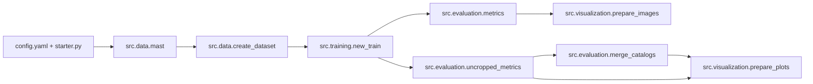
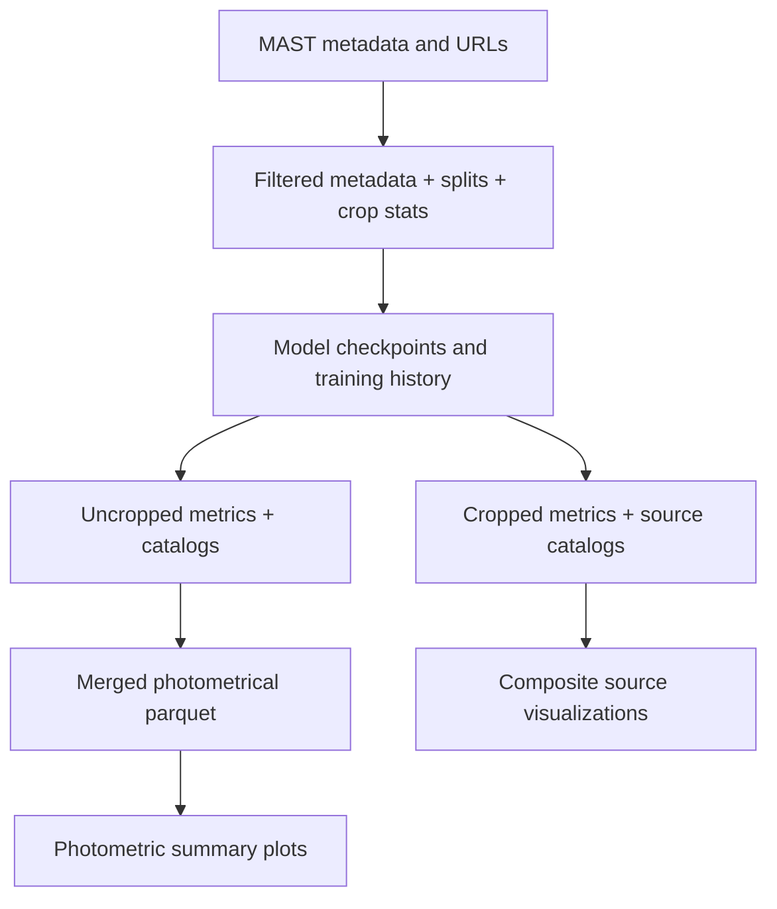

# src

This directory is the executable center of AstroGAN-UNet. The code here is organized as a strict pipeline, not as independent utilities: each stage emits artifacts that become the next stage's inputs.

The package separates concerns in a practical way:

- data acquisition and curation
- model training
- quantitative evaluation
- post-processing and visualization
- HPC orchestration

Most runtime behavior is controlled by `../config.yaml`; the values are loaded and resolved by `../starter.py`.

## What Lives Here

| Area | Location | Purpose |
| --- | --- | --- |
| Data stage | `data/` | Metadata query, URL resolution, dataset filtering, split, and crop statistics |
| Training stage | `training/` | U-Net/GAN training loop, callbacks, and training-time helpers |
| Evaluation stage | `evaluation/` | Cropped/uncropped inference metrics and catalog merge |
| Visualization stage | `visualization/` | Composite image rendering and photometric report plots |
| HPC wrappers | `bash/` | SLURM and local shell orchestration for reproducible runs |

## Canonical Run Order

The production order is:

1. `python -m src.data.mast`
2. `python -m src.data.create_dataset`
3. `python -m src.training.new_train`
4. `python -m src.evaluation.metrics`
5. `python -m src.evaluation.uncropped_metrics`
6. `python -m src.evaluation.merge_catalogs`
7. `python -m src.visualization.prepare_images`
8. `python -m src.visualization.prepare_plots`

The wrappers in `bash/` execute these same stages with job matrices and SLURM integration.

## Pipeline Architecture



## Data and Artifact Flow



## Entry Files You Will Open Most

| File | Why it matters |
| --- | --- |
| `../config.yaml` | Public runtime contract and canonical stage order |
| `../starter.py` | Override parser, config resolution, alias/path expansion |
| `data/mast.py` | Stage 1 entrypoint |
| `data/create_dataset.py` | Stage 2 entrypoint |
| `training/new_train.py` | Stage 3 entrypoint |
| `evaluation/metrics.py` | Stage 4 entrypoint |
| `evaluation/uncropped_metrics.py` | Stage 5 entrypoint |
| `evaluation/merge_catalogs.py` | Stage 6 entrypoint |
| `visualization/prepare_images.py` | Stage 7 entrypoint |
| `visualization/prepare_plots.py` | Stage 8 entrypoint |

## Shared Override Contract

Overrides are parsed centrally by `parse_config_overrides()` in `../starter.py` and are available to all stage scripts.

Supported flags:

- `--nsigma`
- `--footprint-radius`
- `--npixels`
- `--model-type`
- `--attention`
- `--scaling`
- `--loss-name`
- `--dropout-rate`
- `--output-activation`
- `--kernel-initializer`
- `--activation-name`
- `--discriminator-activation`
- `--discriminator-output-activation`
- `--filter-surveys`
- `--filter-by-last-name`
- `--last-name-filter-value`

Examples:

```bash
python -m src.data.create_dataset --nsigma 4 --footprint-radius 7 --npixels 9 --filter-surveys true
python -m src.training.new_train --model-type gan --attention true --scaling log_min_max --loss-name ssim_loss
```

## Stage READMEs

| Stage | README |
| --- | --- |
| Data acquisition and dataset preparation | `data/README.md` |
| Training | `training/README.md` |
| Evaluation and catalog merge | `evaluation/README.md` |
| Visualization | `visualization/README.md` |
| HPC wrappers and scenario orchestration | `bash/README.md` |
