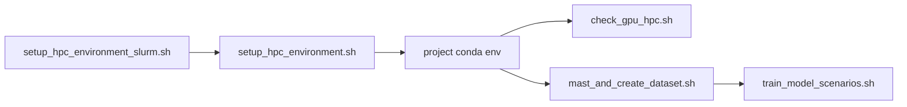

# Bash Orchestration

`src/bash/` contains cluster-oriented wrappers for environment setup, dataset preparation jobs, training scenario sweeps, and GPU checks.

These scripts do not replace Python entrypoints; they orchestrate them with reproducible job tables and scheduler integration.

## Scripts

| Script | Purpose |
| --- | --- |
| `setup_hpc_environment.sh` | Install Miniconda, create/update project conda env at project `.venv` |
| `setup_hpc_environment_slurm.sh` | Submit environment setup as a SLURM batch job |
| `check_gpu_hpc.sh` | Validate GPU visibility (`nvidia-smi`, TensorFlow, PyTorch) |
| `mast_and_create_dataset.sh` | Run stage 1+2 job table (`mast` and `create_dataset`) |
| `train_model_scenarios.sh` | Execute deterministic training scenario matrix across workers |

## Orchestration Flow



## Execution Modes

### Local mode
Most scripts can run locally (without SLURM array variables). Example: `mast_and_create_dataset.sh` loops all job rows if no task ID is provided.

### SLURM mode
Scripts with `#SBATCH` headers can be submitted directly and use scheduler variables such as:

- `SLURM_ARRAY_TASK_ID`
- `SLURM_CPUS_PER_TASK`
- `SLURM_JOB_ID`

## Examples

From `src/`:

```bash
bash bash/setup_hpc_environment.sh --clean-start
sbatch bash/setup_hpc_environment_slurm.sh
sbatch bash/check_gpu_hpc.sh
bash bash/mast_and_create_dataset.sh
sbatch bash/mast_and_create_dataset.sh
sbatch bash/train_model_scenarios.sh
```

## Environment Variables

Common runtime overrides used by scripts:

- `AUN_PROJECT_ROOT`
- `AUN_ENV_PATH`
- `AUN_CONDA_BASE`
- `AUN_LOG_DIR`
- `AUN_RUN_MAST`
- `AUN_RUN_CREATE_DATASET`

Example:

```bash
export AUN_PROJECT_ROOT=/path/to/astroUnets
export AUN_CONDA_BASE=$HOME/.local/miniconda3
bash bash/mast_and_create_dataset.sh
```
