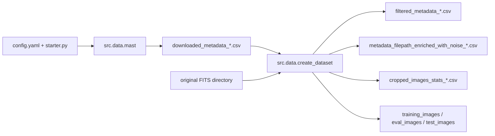

# Data Stage

The data stage is the ingestion and curation boundary of the project. If this stage is inconsistent, every downstream stage (training, evaluation, visualization) inherits that inconsistency.

It has two production entrypoints:

1. `mast.py` acquires metadata and product URLs from MAST.
2. `create_dataset.py` transforms those rows into training/eval/test-ready artifacts.

Both scripts consume the same resolved runtime config from `starter.load_config()`.

## Stage Components

| Script | Purpose | Main config section |
| --- | --- | --- |
| `mast.py` | Query metadata, resolve product links, optional original FITS download | `mast` |
| `create_dataset.py` | Filter, split, crop, and compute image/statistics artifacts | `create_dataset` |

## Data Stage Flow



## Inputs and Outputs

| Stage step | Main inputs | Main outputs |
| --- | --- | --- |
| `mast.py` | mission, filters, MAST query settings | `paths.metadata_csv` (with optional resolved/downloaded products) |
| `create_dataset.py` | metadata CSV + originals directory + split/crop rules | filtered/enriched metadata CSVs, crop stats CSV, split FITS directories |

Primary path controls:

- `paths.data_dir`
- `paths.metadata_csv`
- `paths.training_path`
- `paths.eval_path`
- `paths.test_path`
- `create_dataset.filtered_metadata_output_file`
- `create_dataset.noisy_filtered_metadata_output_file`
- `create_dataset.cropped_stats_output_file`

## Typical Runs

Run from repository root:

```bash
python -m src.data.mast
python -m src.data.create_dataset
```

Run with explicit shared overrides:

```bash
python -m src.data.mast --nsigma 4 --footprint-radius 7 --npixels 9 --filter-surveys true
python -m src.data.create_dataset --filter-by-last-name true --last-name-filter-value FABER
```

## Key Config Ownership

The data stage follows canonical ownership:

1. `paths`
2. `mast`
3. `create_dataset`

This means path and metadata ownership starts in early sections and is reused by later sections via runtime null-resolution.

### `mast`

Defines:

- mission and query filters
- metadata output location
- URL resolution and retry policy
- optional FITS download behavior

### `create_dataset`

Defines:

- survey and PI-name filtering logic
- train/eval/test split construction
- crop and detection hyperparameters (`sigma`, `nsigma`, `npixels`, `footprint_radius`, `maxiters`)
- metadata/statistics output schema and file naming

## Downstream Consumers

Data stage outputs are required by:

- `src.training.new_train` (stats metadata + split images)
- `src.evaluation.metrics` and `src.evaluation.uncropped_metrics` (stats metadata)
- `src.visualization.prepare_images` / `src.visualization.prepare_plots` (metadata references)
