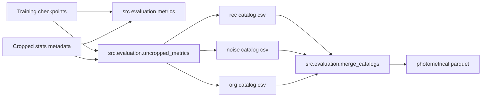

# Evaluation Stage

The evaluation stage is where model quality is converted into measurable artifacts.
It does three things in sequence:

1. evaluate checkpoints on cropped data (`metrics.py`)
2. evaluate selected checkpoints on uncropped/full-size data (`uncropped_metrics.py`)
3. merge rec/noisy/org catalogs into one analysis table (`merge_catalogs.py`)

All three entrypoints resolve runtime values from `starter.load_config()` and consume sections from `config.yaml`.

## Stage Components

| Script | Purpose | Main config section |
| --- | --- | --- |
| `metrics.py` | Cropped metrics, source extraction, and per-model catalog generation | `metrics` |
| `uncropped_metrics.py` | Full-image metrics and uncropped catalog generation | `uncropped_metrics` |
| `merge_catalogs.py` | Proximity-based merge of reconstructed/noisy/original catalogs into parquet | `merge_catalogs` |

## Evaluation Flow



## Inputs and Outputs by Script

| Script | Main inputs | Main outputs |
| --- | --- | --- |
| `metrics.py` | model directory, cropped metadata, metrics extraction kwargs | all/aggregated metrics CSVs, org/noisy/rec catalog CSVs, optional image artifacts |
| `uncropped_metrics.py` | selected model checkpoint, sampled metadata, source extraction kwargs | uncropped result CSV, org/noisy/rec catalog CSVs, histogram CSV/PNGs |
| `merge_catalogs.py` | uncropped org/noisy/rec catalog CSVs | merged parquet (`photometrical_data_filename`) |

## Runtime Behavior Notes

- `metrics.py` accepts two optional leading positional integers before overrides:
  - index
  - concurrent worker count
- `uncropped_metrics.py` internally samples rows and runs one-model uncropped inference using the resolved config contract.
- `merge_catalogs.py` uses `merge_catalog_workers` and `merge_catalog_threshold` from config.

## Typical Runs

```bash
python -m src.evaluation.metrics
python -m src.evaluation.metrics 0 1 --nsigma 4 --footprint-radius 7 --npixels 9
python -m src.evaluation.uncropped_metrics
python -m src.evaluation.merge_catalogs
```

## Key Config Sections

### `metrics`

Controls cropped evaluation behavior:

- source extraction parameters
- model search and selection behavior
- multimodal output path templates
- worker and batching controls

### `uncropped_metrics`

Controls full-image evaluation behavior:

- uncropped sampling counts
- uncropped output directory and filenames
- worker counts and save switches
- histogram bounds and output templates

### `merge_catalogs`

Controls final catalog merge behavior:

- input filename mapping from uncropped outputs
- worker count
- merge proximity threshold
- parquet output filename

## Dependency Boundaries

The evaluation stage relies on upstream artifacts from:

- `new_train` (checkpoint tree and model alias)
- `create_dataset` (cropped metadata/statistics)

Downstream consumers are:

- `src.visualization.prepare_images` (uses metrics artifacts)
- `src.visualization.prepare_plots` (uses merged parquet and uncropped outputs)
