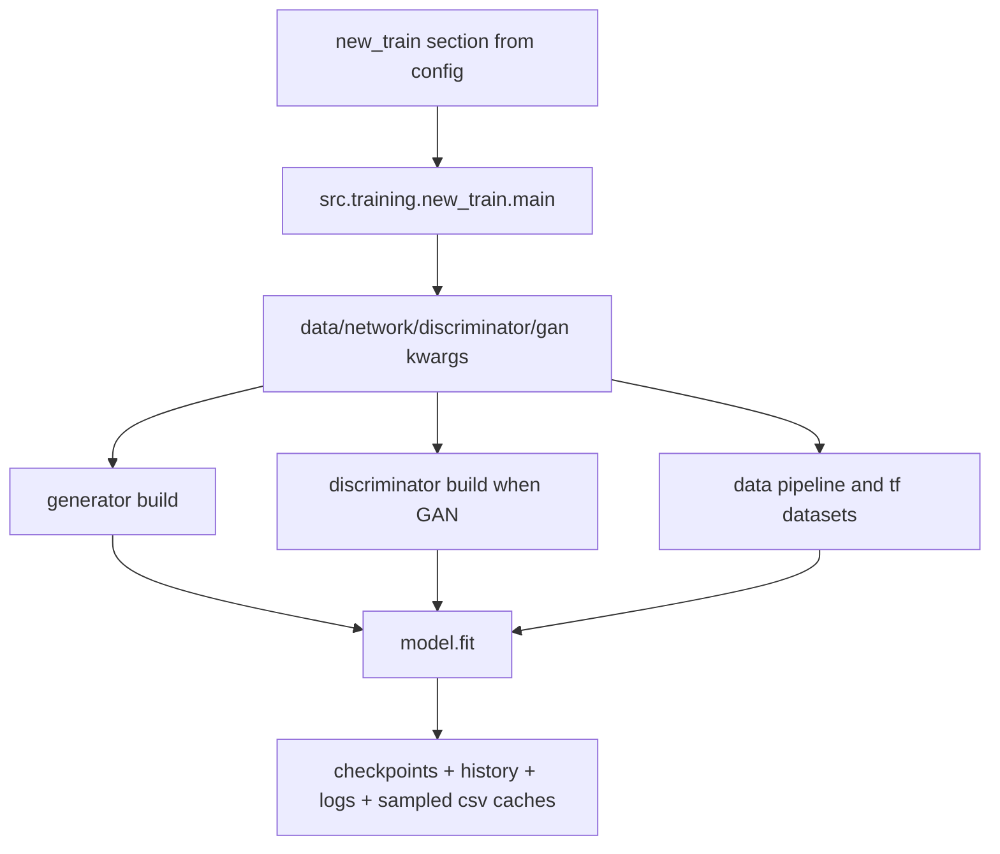
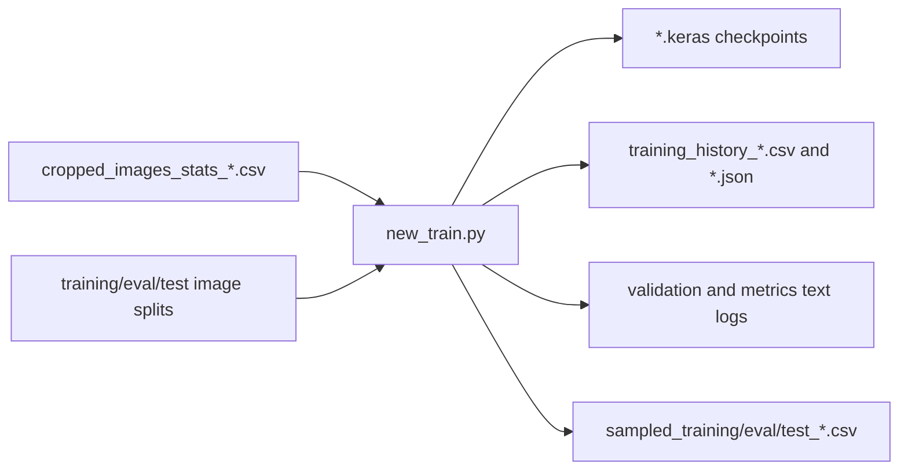

# Training Stage

The training stage converts curated FITS crops into learned reconstruction models.
It is the bridge between data preparation and evaluation, and it is responsible for producing reproducible checkpoint trees that downstream metrics and visualization consume.

The stage supports two runtime modes:

- U-Net generator-only training
- GAN training (generator + discriminator)

## Stage Components

| File | Role |
| --- | --- |
| `new_train.py` | Main training entrypoint and orchestration |
| `callback.py` | Checkpoint, logging, and training callback lifecycle |
| `utils.py` | Dataset assembly, sampling, and data utilities |
| `math_helpers.py` | Numeric helpers for exposure/noise transforms |

## Training Architecture



## Runtime Data Flow

1. Load resolved `new_train` config from `starter.py`.
2. Materialize runtime dictionaries:
   - `data_kwargs`
   - `network_kwargs`
   - `discriminator_kwargs`
   - `gan_kwargs`
3. Build datasets from metadata/statistics and split image directories.
4. Build training graph (U-Net only or GAN).
5. Execute training loop and persist artifacts.

## Artifact Flow



## Typical Runs

Default:

```bash
python -m src.training.new_train
```

GAN run example:

```bash
python -m src.training.new_train --model-type gan --attention true --scaling log_min_max --loss-name ssim_loss --dropout-rate 0.3 --output-activation sigmoid
```

U-Net run example:

```bash
python -m src.training.new_train --model-type unet --attention false --scaling z_scale --loss-name log_cosh_loss
```

## Key Config Sections

Training behavior is configured under `new_train`:

- `new_train.data`
- `new_train.network`
- `new_train.discriminator`
- `new_train.gan`
- `new_train.training`

Inherited values come from earlier owners:

- `create_dataset` (dataset schema and geometry)
- `paths` (path roots for data and model artifacts)

CLI overrides parsed in `starter.py` take precedence over YAML-owned values.

## Downstream Consumers

Training outputs are consumed by:

- `src.evaluation.metrics`
- `src.evaluation.uncropped_metrics`
- `src.visualization.prepare_images`

This makes checkpoint naming and output directory stability critical for reproducible full-pipeline runs.
