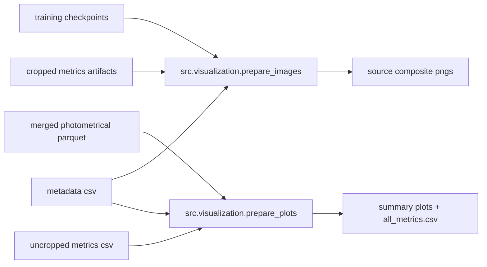

# Visualization Stage

The visualization stage turns evaluation artifacts into interpretable outputs for inspection and reporting.
It is the final stage of the active pipeline and is intentionally split into:

- qualitative image composites (`prepare_images.py`)
- quantitative plot/report outputs (`prepare_plots.py`)

Both entrypoints resolve config from `starter.load_config()` and consume outputs generated by earlier stages.

## Entrypoints

| Script | Purpose | Config section |
| --- | --- | --- |
| `prepare_images.py` | Build original/noisy/reconstructed composite grids and detection overlays | `prepare_images` |
| `prepare_plots.py` | Build quantitative photometric plots and summary metrics tables | `prepare_plots` |

## Visualization Flow



## Inputs and Outputs

### `prepare_images.py`
Inputs:

- metadata CSV (typically from `mast` or data stage outputs)
- selected model checkpoint from training output directory
- shared extraction kwargs for detection overlays

Outputs:

- `<output_dir>/<label>_<crop>.png`
- `<output_dir>/<label>_<crop>_detections.png`

### `prepare_plots.py`
Inputs:

- merged photometric parquet from merge stage
- uncropped metrics CSV
- metadata CSV

Outputs:

- subset plots under `<output_dir>/25` and `<output_dir>/all`
- combined summary table `<output_dir>/all_metrics.csv`

## Typical Runs

```bash
python -m src.visualization.prepare_images
python -m src.visualization.prepare_plots
```

With shared overrides:

```bash
python -m src.visualization.prepare_images --model-type gan --scaling log_min_max
python -m src.visualization.prepare_plots --model-type gan --scaling log_min_max
```

## Key Config Sections

- `prepare_images`: sample size, output directory, metadata path, model path, source extraction kwargs
- `prepare_plots`: output directory, parquet filename, uncropped results CSV, colormaps, normalization quantiles

Visualization inherits core runtime choices from earlier sections (`create_dataset`, `new_train`, `metrics`, `merge_catalogs`) through config resolution in `starter.py`.

## Typical Runs

```bash
python -m src.visualization.prepare_images
python -m src.visualization.prepare_plots
```

With shared overrides:

```bash
python -m src.visualization.prepare_images --model-type gan --scaling log_min_max
python -m src.visualization.prepare_plots --model-type gan --scaling log_min_max
```
